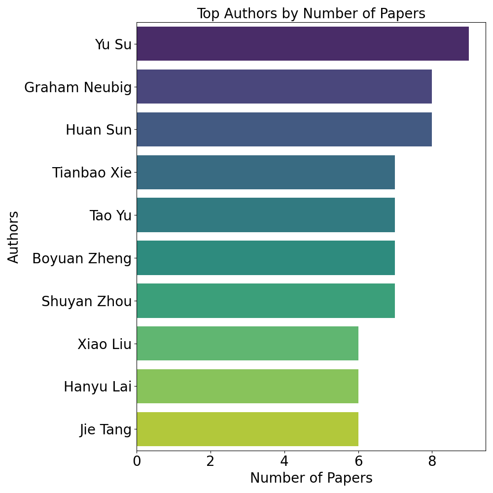

# Awesome GUI Agent Paper List

This repo covers a variety of papers related to GUI Agents, such as:
- Datasets
- Benchmarks
- Models
- Agent frameworks
- Vision, language, multimodal foundation models (with explicit support for GUI)
- Works in general domains extensively used by GUI Agents (e.g., SoM prompting)


[//]: # (<div style="display: flex; justify-content: space-around;">)

[//]: # (  )

[//]: # (  )

[//]: # (</div>)


## Papers Grouped by Environments
| [Web](paper_by_env/paper_web.md) | [Mobile](paper_by_env/paper_mobile.md) | [Desktop](paper_by_env/paper_desktop.md) | [GUI](paper_by_env/paper_gui.md) | [Misc](paper_by_env/paper_misc.md) |
|--------------------------------|---------------------------------------|------------------------------------------|----------------------------------|------------------------------------|

(Misc: Papers for general topics that have important applications in GUI agents.)

## Papers Grouped by Keywords
[framework (105)](paper_by_key/paper_framework.md) | [benchmark (68)](paper_by_key/paper_benchmark.md) | [dataset (63)](paper_by_key/paper_dataset.md) | [model (31)](paper_by_key/paper_model.md) | [reinforcement learning (13)](paper_by_key/paper_reinforcement_learning.md) | [safety (11)](paper_by_key/paper_safety.md) | [visual grounding (8)](paper_by_key/paper_visual_grounding.md) | [planning (7)](paper_by_key/paper_planning.md) | [reasoning (5)](paper_by_key/paper_reasoning.md) | [grounding (5)](paper_by_key/paper_grounding.md) | [vision language model (5)](paper_by_key/paper_vision_language_model.md) | [survey (4)](paper_by_key/paper_survey.md) | [attack (4)](paper_by_key/paper_attack.md) | [evaluation (4)](paper_by_key/paper_evaluation.md) | [synthetic data (3)](paper_by_key/paper_synthetic_data.md) | [learning (3)](paper_by_key/paper_learning.md) | [foundation model (3)](paper_by_key/paper_foundation_model.md) | [UI understanding (3)](paper_by_key/paper_UI_understanding.md) | [self-improvement (3)](paper_by_key/paper_self-improvement.md) | [programming-by-demonstration (3)](paper_by_key/paper_programming-by-demonstration.md)

## Papers Grouped by Authors
[Yu Su (9)](paper_by_author/paper_Yu_Su.md) | [Graham Neubig (8)](paper_by_author/paper_Graham_Neubig.md) | [Huan Sun (8)](paper_by_author/paper_Huan_Sun.md) | [Tianbao Xie (7)](paper_by_author/paper_Tianbao_Xie.md) | [Tao Yu (7)](paper_by_author/paper_Tao_Yu.md) | [Boyuan Zheng (7)](paper_by_author/paper_Boyuan_Zheng.md) | [Shuyan Zhou (7)](paper_by_author/paper_Shuyan_Zhou.md) | [Xiao Liu (6)](paper_by_author/paper_Xiao_Liu.md) | [Hanyu Lai (6)](paper_by_author/paper_Hanyu_Lai.md) | [Jie Tang (6)](paper_by_author/paper_Jie_Tang.md) | [Yuxiao Dong (6)](paper_by_author/paper_Yuxiao_Dong.md) | [Difei Gao (5)](paper_by_author/paper_Difei_Gao.md) | [Mike Zheng Shou (5)](paper_by_author/paper_Mike_Zheng_Shou.md) | [Zhiyong Wu (5)](paper_by_author/paper_Zhiyong_Wu.md) | [Daniel Fried (5)](paper_by_author/paper_Daniel_Fried.md) | [Toby Jia-Jun Li (5)](paper_by_author/paper_Toby_Jia-Jun_Li.md) | [Ruslan Salakhutdinov (4)](paper_by_author/paper_Ruslan_Salakhutdinov.md) | [Caiming Xiong (4)](paper_by_author/paper_Caiming_Xiong.md) | [Boyu Gou (4)](paper_by_author/paper_Boyu_Gou.md) | [Yu Gu (4)](paper_by_author/paper_Yu_Gu.md)

## All Papers (from most recent to oldest)
<details open>
<summary>Papers</summary>

- [OS Agents: A Survey on MLLM-based Agents for General Computing Devices Use](https://github.com/OS-Agent-Survey/OS-Agent-Survey/blob/main/paper.pdf)
    - Xueyu Hu, Tao Xiong, Biao Yi, Zishu Wei, Ruixuan Xiao, Yurun Chen, Jiasheng Ye, Meiling Tao, Xiangxin Zhou, Ziyu Zhao, Yuhuai Li, Shengze Xu, Shawn Wang, Xinchen Xu, Shuofei Qiao , Kun Kuang, Tieyong Zeng, Liang Wang, Jiwei Li, Yuchen Eleanor Jiang, Wangchunshu Zhou, Guoyin Wang, Keting Yin, Zhou Zhao, Hongxia Yang, Fan Wu, Shengyu Zhang, Fei Wu
    - 🏛️ Institutions: Zhejiang University, Fudan University, OPPO AI Center, University of Chinese Academy of Sciences, Institute of Automation, Chinese Academy of Sciences, The Chinese University of Hong Kong, Tsinghua University, 01.AI, The Hong Kong Polytechnic University, Shanghai Jiao Tong University,
    - 📅 Date: December 20, 2024
    - 📑 Publisher: https://os-agent-survey.github.io/
    - 💻 Env: [GUI]
    - 🔑 Key: [survey]
    - 📖 TLDR: This survey aims to advance the research and development of OS Agents by providing a detailed exploration of their fundamental capabilities, methodologies for building them using (M)LLMs, and emerging trends in the field. While OS Agents are still in the early stages of growth, the rapid evolution of technology continues to introduce innovative approaches and applications. This work seeks to highlight ongoing challenges, future opportunities, and the latest developments, encouraging further research and industrial adoption. Ultimately, we hope this study will serve as a catalyst for innovation, driving meaningful progress in both academia and industry.

- [GUI Agents: A Survey](https://arxiv.org/abs/2412.13501)
    - Dang Nguyen, Jian Chen, Yu Wang, Gang Wu, Namyong Park, Zhengmian Hu, Hanjia Lyu, Junda Wu, Ryan Aponte, Yu Xia, Xintong Li, Jing Shi, Hongjie Chen, Viet Dac Lai, Zhouhang Xie, Sungchul Kim, Ruiyi Zhang, Tong Yu, Mehrab Tanjim, Nesreen K. Ahmed, Puneet Mathur, Seunghyun Yoon, Lina Yao, Branislav Kveton, Thien Huu Nguyen, Trung Bui, Tianyi Zhou, Ryan A. Rossi, Franck Dernoncourt
    - 🏛️ Institutions: UMD, SUNY Buffalo, University of Oregon, Adobe Research, Meta AI, University of Rochester, UCSD, CMU, Dolby Labs, Intel AI Research, UNSW
    - 📅 Date: December 18, 2024
    - 📑 Publisher: arXiv
    - 💻 Env: [GUI]
    - 🔑 Key: [survey]
    - 📖 TLDR: This survey provides a comprehensive overview of GUI agents powered by Large Foundation Models, detailing their benchmarks, evaluation metrics, architectures, and training methods. It introduces a unified framework outlining their perception, reasoning, planning, and acting capabilities, identifies open challenges, and discusses future research directions, serving as a resource for both practitioners and researchers in the field.

- [Proposer-Agent-Evaluator (PAE): Autonomous Skill Discovery For Foundation Model Internet Agents](https://arxiv.org/abs/2412.13194)
    - Yifei Zhou, Qianlan Yang, Kaixiang Lin, Min Bai, Xiong Zhou, Yu-Xiong Wang, Sergey Levine, Erran Li
    - 🏛️ Institutions: UCB, UIUC, Amazon
    - 📅 Date: December 17, 2024
    - 📑 Publisher: arXiv
    - 💻 Env: [Web]
    - 🔑 Key: [framework], [reinforcement learning], [skill discovery], [PAE]
    - 📖 TLDR: This paper introduces the Proposer-Agent-Evaluator (PAE) system, enabling foundation model agents to autonomously discover and practice skills in real-world web environments. PAE comprises a context-aware task proposer, an agent policy for task execution, and a vision-language model-based success evaluator. Validated on vision-based web navigation tasks, PAE significantly enhances zero-shot generalization capabilities of vision-language model Internet agents, achieving over 30% relative improvement on unseen tasks and websites, and surpassing state-of-the-art open-source agents by more than 10%.

- [Iris: Breaking GUI Complexity with Adaptive Focus and Self-Refining](https://arxiv.org/abs/2412.10342)
    - Zhiqi Ge, Juncheng Li, Xinglei Pang, Minghe Gao, Kaihang Pan, Wang Lin, Hao Fei, Wenqiao Zhang, Siliang Tang, Yueting Zhuang
    - 🏛️ Institutions: Zhejiang University, NUS
    - 📅 Date: December 13, 2024
    - 📑 Publisher: arXiv
    - 💻 Env: [GUI]
    - 🔑 Key: [framework], [Information-Sensitive Cropping], [Self-Refining Dual Learning], [visual grounding], [model]
    - 📖 TLDR: This paper introduces *Iris*, a visual agent designed to enhance GUI automation by addressing challenges in high-resolution, complex digital environments. It employs two key innovations: **Information-Sensitive Cropping (ISC)**, which dynamically identifies and prioritizes visually dense regions using an edge detection algorithm for efficient processing, and **Self-Refining Dual Learning (SRDL)**, which enhances the agent's ability to handle complex tasks through a dual-learning loop that iteratively refines its performance without requiring additional annotated data. Empirical evaluations demonstrate that Iris achieves state-of-the-art performance across multiple benchmarks with only 850K GUI annotations, outperforming methods using ten times more training data.

- [Falcon-UI: Understanding GUI Before Following User Instructions](https://arxiv.org/abs/2412.09362)
    - Huawen Shen, Chang Liu, Gengluo Li, Xinlong Wang, Yu Zhou, Can Ma, Xiangyang Ji
    - 🏛️ Institutions: Chinese Academy of Sciences, Tsinghua University, Nankai University, BAAI
    - 📅 Date: Dec 12, 2024
    - 📑 Publisher: arXiv
    - 💻 Env: [GUI]
    - 🔑 Key: [model], [dataset], [Falcon-UI], [GUI understanding]
    - 📖 TLDR: This paper introduces *Falcon-UI*, a GUI agent model that emphasizes understanding GUI contexts before following user instructions. The authors present the *Insight-UI Dataset*, an instruction-free GUI navigation dataset generated from the Common Crawl corpus, simulating various platforms like iOS, Android, Windows, and Linux across multiple resolutions on 312K domains. Falcon-UI is pretrained on this dataset and fine-tuned on Android and Web GUI datasets, achieving performance comparable to larger models, highlighting the importance of decoupling GUI understanding from instruction following in agent performance. 

- [The BrowserGym Ecosystem for Web Agent Research](https://arxiv.org/abs/2412.05467)
    - Thibault Le Sellier De Chezelles, Maxime Gasse, Alexandre Drouin, Massimo Caccia, Léo Boisvert, Megh Thakkar, Tom Marty, Rim Assouel, Sahar Omidi Shayegan, Lawrence Keunho Jang, Xing Han Lù, Ori Yoran, Dehan Kong, Frank F. Xu, Siva Reddy, Quentin Cappart, Graham Neubig, Ruslan Salakhutdinov, Nicolas Chapados, Alexandre Lacoste
    - 🏛️ Institutions: ServiceNow Research, Mila, Polytechnique Montréal, CMU, McGill University, Tel Aviv University, Université de Montréal, iMean AI
    - 📅 Date: December 6, 2024
    - 📑 Publisher: arXiv
    - 💻 Env: [Web]
    - 🔑 Key: [benchmark], [framework], [LLM], [automation], [BrowserGym], [AgentLab]
    - 📖 TLDR: This paper presents *BrowserGym*, an ecosystem designed to standardize the evaluation and benchmarking of web agents, particularly those leveraging Large Language Models (LLMs). It addresses the challenges posed by fragmented benchmarks and inconsistent methodologies in web agent research. BrowserGym provides a unified, gym-like environment with clearly defined observation and action spaces, enabling reproducible comparisons across various benchmarks. Additionally, *AgentLab*, a complementary framework, supports agent creation, testing, and analysis. The paper also features a large-scale experiment comparing the performance of 6 leading LLMs, highlighting the strengths and weaknesses of different models in real-world web tasks, while emphasizing the ongoing challenges in building efficient and robust web agents.

- [Aguvis: Unified Pure Vision Agents for Autonomous GUI Interaction](https://aguvis-project.github.io/)
    - Yiheng Xu, Zekun Wang, Junli Wang, Dunjie Lu, Tianbao Xie, Amrita Saha, Doyen Sahoo, Tao Yu, Caiming Xiong
    - 🏛️ Institutions: HKU, NTU, Salesforce
    - 📅 Date: Dec 5, 2024
    - 📑 Publisher: arXiv
    - 💻 Env: [GUI]
    - 🔑 Key: [model], [dataset], [planning], [reasoning], [Aguvis], [visual grounding]
    - 📖 TLDR: This paper introduces *Aguvis*, a unified pure vision-based framework for autonomous GUI agents that operates across various platforms. It leverages image-based observations and grounds natural language instructions to visual elements, employing a consistent action space to ensure cross-platform generalization. The approach integrates explicit planning and reasoning within the model, enhancing its ability to autonomously navigate and interact with complex digital environments. A large-scale dataset of GUI agent trajectories is constructed, incorporating multimodal reasoning and grounding. Comprehensive experiments demonstrate that Aguvis surpasses previous state-of-the-art methods in both offline and real-world online scenarios, achieving the first fully autonomous pure vision GUI agent capable of performing tasks independently without collaboration with external closed-source models. All datasets, models, and training recipes are open-sourced to facilitate future research.

- [ShowUI: One Vision-Language-Action Model for GUI Visual Agent](https://arxiv.org/abs/2411.17465)
    - Kevin Qinghong Lin, Linjie Li, Difei Gao, Zhengyuan Yang, Shiwei Wu, Zechen Bai, Weixian Lei, Lijuan Wang, Mike Zheng Shou
    - 🏛️ Institutions: NUS, Microsoft
    - 📅 Date: November 26, 2024
    - 📑 Publisher: arXiv
    - 💻 Env: [GUI]
    - 🔑 Key: [model], [framework], [dataset], [UI-Guided Visual Token Selection], [Interleaved Vision-Language-Action Streaming], [ShowUI]
    - 📖 TLDR: This paper introduces *ShowUI*, a vision-language-action model designed to enhance GUI automation by addressing challenges in UI visual perception and action modeling. It features innovations like UI-Guided Visual Token Selection to reduce computational costs and Interleaved Vision-Language-Action Streaming for effective management of visual-action history. Trained on a curated dataset, ShowUI achieves 75.1% accuracy in zero-shot screenshot grounding and demonstrates competitive performance across web, mobile, and online environments.

- [AdaptAgent: Adapting Multimodal Web Agents with Few-Shot Learning from Human Demonstrations](https://arxiv.org/abs/2411.13451)
    - Gaurav Verma, Rachneet Kaur, Nishan Srishankar, Zhen Zeng, Tucker Balch, Manuela Veloso
    - 🏛️ Institutions: J.P. Morgan AI Research
    - 📅 Date: November 24, 2024
    - 📑 Publisher: arXiv
    - 💻 Env: [Web]
    - 🔑 Key: [framework], [few-shot learning], [meta-learning], [AdaptAgent]
    - 📖 TLDR: This paper introduces **AdaptAgent**, a framework that enables multimodal web agents to adapt to new websites and domains using few human demonstrations (up to 2). The approach enhances agents' adaptability beyond large-scale pre-training and fine-tuning by leveraging in-context learning and meta-learning techniques. Experiments on benchmarks like Mind2Web and VisualWebArena show that incorporating minimal human demonstrations boosts task success rates significantly, highlighting the effectiveness of multimodal demonstrations over text-only ones and the impact of data selection strategies during meta-learning on agent generalization.

- [Improved GUI Grounding via Iterative Narrowing](https://arxiv.org/abs/2411.13591)
    - Anthony Nguyen
    - 🏛️ Institutions: Algoma University
    - 📅 Date: November 18, 2024
    - 📑 Publisher: arXiv
    - 💻 Env: [GUI]
    - 🔑 Key: [framework], [grounding], [visual grounding], [iterative narrowing]
    - 📖 TLDR: This paper introduces a visual framework to enhance GUI grounding. By iteratively refining model predictions through progressively focused image crops, the proposed method improves the performance of both general and fine-tuned Vision-Language Models (VLMs) in GUI grounding tasks.

- [Generalist Virtual Agents: A Survey on Autonomous Agents Across Digital Platforms](https://arxiv.org/abs/2411.10943)
    - Minghe Gao, Wendong Bu, Bingchen Miao, Yang Wu, Yunfei Li, Juncheng Li, Siliang Tang, Qi Wu, Yueting Zhuang, Meng Wang
    - 🏛️ Institutions: Zhejiang University, University of Adelaide, Hefei University of Technology
    - 📅 Date: November 17, 2024
    - 📑 Publisher: arXiv
    - 💻 Env: [GUI]
    - 🔑 Key: [survey], [Generalist Virtual Agent], [GVA], [autonomous agents], [digital platforms]
    - 📖 TLDR: This survey introduces the concept of Generalist Virtual Agents (GVAs), autonomous entities designed to operate across various digital platforms and environments to assist users in performing diverse tasks. It traces the evolution of GVAs from early intelligent assistants to modern implementations incorporating large-scale models, discussing their philosophical foundations, development challenges, and current methodologies. The paper provides a detailed taxonomy of GVA environments, tasks, and capabilities, aiming to bridge theoretical and practical aspects and suggesting that agents operating in environments closely mirroring the real world are more likely to exhibit human-like intelligence.

- [The Dawn of GUI Agent: A Preliminary Case Study with Claude 3.5 Computer Use](https://arxiv.org/abs/2411.10323)
    - Siyuan Hu, Mingyu Ouyang, Difei Gao, Mike Zheng Shou
    - 🏛️ Institutions: NUS
    - 📅 Date: Nov 15, 2024
    - 📑 Publisher: arXiv
    - 💻 Env: [Desktop]
    - 🔑 Key: [framework], [Claude 3.5 Computer Use], [GUI automation], [planning], [action], [critic]
    - 📖 TLDR: This study evaluates Claude 3.5 Computer Use, an AI model enabling end-to-end language-to-desktop actions, through curated tasks across various domains. It introduces an out-of-the-box framework for deploying API-based GUI automation models, analyzing the model's planning, action execution, and adaptability to dynamic environments.

- [WebOlympus: An Open Platform for Web Agents on Live Websites](https://aclanthology.org/2024.emnlp-demo.20/)
    - Boyuan Zheng, Boyu Gou, Scott Salisbury, Zheng Du, Huan Sun, Yu Su
    - 🏛️ Institutions: OSU
    - 📅 Date: November 12, 2024
    - 📑 Publisher: EMNLP 2024
    - 💻 Env: [Web]
    - 🔑 Key: [safety], [Chrome extension], [WebOlympus], [SeeAct], [Annotation Tool]
    - 📖 TLDR: This paper introduces *WebOlympus*, an open platform designed to facilitate the research and deployment of web agents on live websites. It features a user-friendly Chrome extension interface, allowing users without programming expertise to operate web agents with minimal effort. The platform incorporates a safety monitor module to prevent harmful actions through human supervision or model-based control, supporting applications such as annotation interfaces for web agent trajectories and data crawling.

- [Is Your LLM Secretly a World Model of the Internet? Model-Based Planning for Web Agents](https://arxiv.org/abs/2411.06559)
    - Yu Gu, Boyuan Zheng, Boyu Gou, Kai Zhang, Cheng Chang, Sanjari Srivastava, Yanan Xie, Peng Qi, Huan Sun, Yu Su
    - 🏛️ Institutions: OSU, Orby AI
    - 📅 Date: November 10, 2024
    - 📑 Publisher: arXiv
    - 💻 Env: [Web]
    - 🔑 Key: [framework], [WebDreamer], [model-based planning], [world model]
    - 📖 TLDR: This paper investigates whether Large Language Models (LLMs) can function as world models within web environments, enabling model-based planning for web agents. Introducing **WebDreamer**, a framework that leverages LLMs to simulate potential action sequences in web environments, the study demonstrates significant performance improvements over reactive baselines on benchmarks like VisualWebArena and Mind2Web-live. The findings suggest that LLMs possess the capability to model the dynamic nature of the internet, paving the way for advancements in automated web interaction and opening new research avenues in optimizing LLMs for complex, evolving environments.

- [GUI Agents with Foundation Models: A Comprehensive Survey](https://arxiv.org/abs/2411.04890)
    - Shuai Wang, Weiwen Liu, Jingxuan Chen, Weinan Gan, Xingshan Zeng, Shuai Yu, Xinlong Hao, Kun Shao, Yasheng Wang, Ruiming Tang
    - 🏛️ Institutions: Huawei Noah’s Ark Lab
    - 📅 Date: November 7, 2024
    - 📑 Publisher: arXiv
    - 💻 Env: [GUI]
    - 🔑 Key: [survey]
    - 📖 TLDR: This survey consolidates recent research on GUI agents powered by foundation models, particularly Large Language Models (LLMs) and Multimodal Large Language Models (MLLMs). It discusses representative datasets and benchmarks, summarizes a unified framework capturing essential components from prior studies, and explores commercial applications. The paper identifies key challenges and proposes future research directions to inspire further developments in (M)LLM-based GUI agents.

- [WebRL: Training LLM Web Agents via Self-Evolving Online Curriculum Reinforcement Learning](https://arxiv.org/abs/2411.02337v1)
    - Zehan Qi, Xiao Liu, Iat Long Iong, Hanyu Lai, Xueqiao Sun, Xinyue Yang, Jiadai Sun, Yu Yang, Shuntian Yao, Tianjie Zhang, Wei Xu, Jie Tang, Yuxiao Dong
    - 🏛️ Institutions: Tsinghua University, BAAI
    - 📅 Date: November 4, 2024
    - 📑 Publisher: arXiv
    - 💻 Env: [Web]
    - 🔑 Key: [framework], [reinforcement learning], [self-evolving curriculum], [WebRL], [outcome-supervised reward model]
    - 📖 TLDR: This paper introduces *WebRL*, a self-evolving online curriculum reinforcement learning framework designed to train high-performance web agents using open large language models (LLMs). WebRL addresses challenges such as the scarcity of training tasks, sparse feedback signals, and policy distribution drift in online learning. It incorporates a self-evolving curriculum that generates new tasks from unsuccessful attempts, a robust outcome-supervised reward model (ORM), and adaptive reinforcement learning strategies to ensure consistent improvements. Applied to Llama-3.1 and GLM-4 models, WebRL significantly enhances their performance on web-based tasks, surpassing existing state-of-the-art web agents.

- [Attacking Vision-Language Computer Agents via Pop-ups](https://arxiv.org/abs/2411.02391)
    - Yanzhe Zhang, Tao Yu, Diyi Yang
    - 🏛️ Institutions: Georgia Tech, HKU, Stanford
    - 📅 Date: Nov 4, 2024
    - 📑 Publisher: arXiv
    - 💻 Env: [GUI]
    - 🔑 Key: [attack], [adversarial pop-ups], [VLM agents], [safety]
    - 📖 TLDR: This paper demonstrates that vision-language model (VLM) agents can be easily deceived by carefully designed adversarial pop-ups, leading them to perform unintended actions such as clicking on these pop-ups instead of completing their assigned tasks. Integrating these pop-ups into environments like OSWorld and VisualWebArena resulted in an average attack success rate of 86% and a 47% decrease in task success rate. Basic defense strategies, such as instructing the agent to ignore pop-ups or adding advertisement notices, were found to be ineffective against these attacks.

- [From Context to Action: Analysis of the Impact of State Representation and Context on the Generalization of Multi-Turn Web Navigation Agents](https://arxiv.org/abs/2409.13701)
    - Nalin Tiwary, Vardhan Dongre, Sanil Arun Chawla, Ashwin Lamani, Dilek Hakkani-Tür
    - 🏛️ Institutions: UIUC
    - 📅 Date: October 31, 2024
    - 📑 Publisher: arXiv
    - 💻 Env: [Web]
    - 🔑 Key: [framework], [context management], [generalization], [multi-turn navigation], [CWA]
    - 📖 TLDR: This study examines how different contextual elements affect the performance and generalization of Conversational Web Agents (CWAs) in multi-turn web navigation tasks. By optimizing context management—specifically interaction history and web page representation—the research demonstrates enhanced agent performance across various out-of-distribution scenarios, including unseen websites, categories, and geographic locations.

- [AndroidLab: Training and Systematic Benchmarking of Android Autonomous Agents](https://arxiv.org/abs/2410.24024)
    - Yifan Xu, Xiao Liu, Xueqiao Sun, Siyi Cheng, Hao Yu, Hanyu Lai, Shudan Zhang, Dan Zhang, Jie Tang, Yuxiao Dong
    - 🏛️ Institutions: Tsinghua University, Peking University
    - 📅 Date: October 31, 2024
    - 📑 Publisher: arXiv
    - 💻 Env: [Mobile]
    - 🔑 Key: [framework], [dataset], [benchmark], [AndroidLab]
    - 📖 TLDR: This paper introduces **AndroidLab**, a comprehensive framework for training and systematically benchmarking Android autonomous agents. It provides an operational environment with diverse modalities and action spaces, supporting both large language models (LLMs) and multimodal models (LMMs). The benchmark includes 138 tasks across nine apps on predefined Android virtual devices. Utilizing AndroidLab, the authors developed an Android Instruction dataset and trained six open-source LLMs and LMMs, significantly improving their average success rates.

- [OS-ATLAS: A Foundation Action Model For Generalist GUI Agents](https://osatlas.github.io/)
    - Zhiyong Wu, Zhenyu Wu, Fangzhi Xu, Yian Wang, Qiushi Sun, Chengyou Jia, Kanzhi Cheng, Zichen Ding, Liheng Chen, Paul Pu Liang, Yu Qiao
    - 🏛️ Institutions: Shanghai AI Lab, Shanghai Jiaotong University, HKU, MIT
    - 📅 Date: October 30, 2024
    - 📑 Publisher: arXiv
    - 💻 Env: [GUI]
    - 🔑 Key: [model], [dataset], [benchmark], [OS-Atlas]
    - 📖 TLDR: This paper introduces OS-Atlas, a foundational GUI action model designed to enhance GUI grounding and out-of-distribution tasks. The authors developed a toolkit to synthesize multi-platform GUI grounding data, resulting in a cross-platform corpus of over 13 million GUI elements. OS-Atlas demonstrates significant performance improvements across six benchmarks spanning mobile, desktop, and web platforms.

- [Evaluating Cultural and Social Awareness of LLM Web Agents](https://arxiv.org/abs/2410.23252)
    - Haoyi Qiu, Alexander R. Fabbri, Divyansh Agarwal, Kung-Hsiang Huang, Sarah Tan, Nanyun Peng, Chien-Sheng Wu
    - 🏛️ Institutions: UCLA, Salesforce AI Research
    - 📅 Date: October 30, 2024
    - 📑 Publisher: arXiv
    - 💻 Env: [Web]
    - 🔑 Key: [benchmark], [CASA], [cultural awareness], [social awareness], [fine-tuning], [prompting]
    - 📖 TLDR: This paper introduces CASA, a benchmark designed to assess the cultural and social awareness of LLM web agents in tasks like online shopping and social discussion forums. It evaluates agents' abilities to detect and appropriately respond to norm-violating user queries and observations. The study finds that current LLM agents have limited cultural and social awareness, with less than 10% awareness coverage and over 40% violation rates. To enhance performance, the authors explore prompting and fine-tuning methods, demonstrating that combining both can offer complementary advantages.

- [Auto-Intent: Automated Intent Discovery and Self-Exploration for Large Language Model Web Agents](https://arxiv.org/abs/2410.22552)
    - Jaekyeom Kim, Dong-Ki Kim, Lajanugen Logeswaran, Sungryull Sohn, Honglak Lee
    - 🏛️ Institutions: LG AI Research, Field AI, University of Michigan
    - 📅 Date: October 29, 2024
    - 📑 Publisher: EMNLP 2024 (Findings)
    - 💻 Env: [Web]
    - 🔑 Key: [framework], [Auto-Intent]
    - 📖 TLDR: The paper presents Auto-Intent, a method to adapt pre-trained large language models for web navigation tasks without direct fine-tuning. It discovers underlying intents from domain demonstrations and trains an intent predictor to enhance decision-making. Auto-Intent improves the performance of GPT-3.5, GPT-4, and Llama-3.1 agents on benchmarks like Mind2Web and WebArena.

- [EDGE: Enhanced Grounded GUI Understanding with Enriched Multi-Granularity Synthetic Data](https://doi.org/10.48550/arXiv.2410.19461)
    - Xuetian Chen, Hangcheng Li, Jiaqing Liang, Sihang Jiang, Deqing Yang
    - 🏛️ Institutions: Fudan University
    - 📅 Date: October 25, 2024
    - 📑 Publisher: arXiv
    - 💻 Env: [GUI]
    - 🔑 Key: [dataset], [framework], [synthetic data]
    - 📖 TLDR: The *EDGE* framework proposes an innovative approach to improve GUI understanding and interaction capabilities in vision-language models through large-scale, multi-granularity synthetic data generation. By leveraging webpage data, EDGE minimizes the need for manual annotations and enhances the adaptability of models across desktop and mobile GUI environments. Evaluations show its effectiveness in diverse GUI-related tasks, contributing significantly to autonomous agent development in GUI navigation and interaction.

- [OpenWebVoyager: Building Multimodal Web Agents via Iterative Real-World Exploration, Feedback and Optimization](https://doi.org/10.48550/arXiv.2410.19609)
    - Hongliang He, Wenlin Yao, Kaixin Ma, Wenhao Yu, Hongming Zhang, Tianqing Fang, Zhenzhong Lan, Dong Yu
    - 🏛️ Institutions: Zhejiang University, Tencent AI Lab, Westlake University
    - 📅 Date: October 25, 2024
    - 📑 Publisher: arXiv
    - 💻 Env: [Web]
    - 🔑 Key: [framework], [learning], [imitation learning], [exploration], [AI feedback]
    - 📖 TLDR: The paper presents **OpenWebVoyager**, an open-source framework for training web agents that explore real-world online environments autonomously. The framework employs a cycle of exploration, feedback, and optimization, enhancing agent capabilities through multimodal perception and iterative learning. Initial skills are acquired through imitation learning, followed by real-world exploration, where the agent’s performance is evaluated and refined through feedback loops.

- [AutoGLM: Autonomous Foundation Agents for GUIs](https://xiao9905.github.io/AutoGLM/)
    - Xiao Liu, Bo Qin, Dongzhu Liang, Guang Dong, Hanyu Lai, Hanchen Zhang, Hanlin Zhao, Iat Long Iong, Jiadai Sun, Jiaqi Wang, Junjie Gao, Junjun Shan, Kangning Liu, Shudan Zhang, Shuntian Yao, Siyi Cheng, Wentao Yao, Wenyi Zhao, Xinghan Liu, Xinyi Liu, Xinying Chen, Xinyue Yang, Yang Yang, Yifan Xu, Yu Yang, Yujia Wang, Yulin Xu, Zehan Qi, Yuxiao Dong, Jie Tang
    - 🏛️ Institutions: Zhipu AI, Tsinghua University
    - 📅 Date: October 25, 2024
    - 📑 Publisher: arXiv
    - 💻 Env: [GUI]
    - 🔑 Key: [framework], [model], [learning], [AutoGLM]
    - 📖 TLDR: This paper introduces AutoGLM, a new series in the ChatGLM family, designed as foundation agents for autonomous control of digital devices through GUIs. It addresses the challenges foundation models face in decision-making within dynamic environments by developing agents capable of learning through autonomous interactions. Focusing on web browsers and Android devices, AutoGLM integrates various techniques to create deployable agent systems. Key insights include the importance of designing an appropriate "intermediate interface" for GUI control and a novel progressive training framework for self-evolving online curriculum reinforcement learning. Evaluations demonstrate AutoGLM's effectiveness across multiple domains, achieving notable success rates in web browsing and Android device control tasks.

- [VideoWebArena: Evaluating Long Context Multimodal Agents with Video Understanding Web Tasks](https://doi.org/10.48550/arXiv.2410.19100)
    - Lawrence Jang, Yinheng Li, Charles Ding, Justin Lin, Paul Pu Liang, Dan Zhao, Rogerio Bonatti, Kazuhito Koishida
    - 🏛️ Institutions: CMU, MIT, NYU, Microsoft
    - 📅 Date: October 24, 2024
    - 📑 Publisher: arXiv
    - 💻 Env: [Web]
    - 🔑 Key: [benchmark], [dataset], [video understanding], [long-context], [VideoWA]
    - 📖 TLDR: This paper introduces **VideoWebArena (VideoWA)**, a benchmark assessing multimodal agents in video-based tasks. It features over 2,000 tasks focused on skill and factual retention, using video tutorials to simulate long-context environments. Results highlight current challenges in agentic abilities, providing a critical testbed for long-context video understanding improvements.

- [Beyond Browsing: API-Based Web Agents](https://arxiv.org/pdf/2410.16464)
    - Yueqi Song, Frank Xu, Shuyan Zhou, Graham Neubig
    - 🏛️ Institutions: CMU
    - 📅 Date: October 24, 2024
    - 📑 Publisher: arXiv
    - 💻 Env: [Web]
    - 🔑 Key: [API-based agent], [hybrid agent], [benchmark], [WebArena], [SOTA performance]
    - 📖 TLDR: This paper introduces API-based and hybrid agents designed to execute online tasks by accessing both APIs and traditional web browsing interfaces. In evaluations using WebArena, a benchmark for web navigation, the API-based agent achieves higher performance than browser-based agents, and the hybrid model achieves a success rate of 35.8%, setting a new state-of-the-art (SOTA) in task-agnostic web navigation. The findings highlight the efficiency and reliability gains of API interactions for web agents.

- [AgentStore: Scalable Integration of Heterogeneous Agents As Specialized Generalist Computer Assistant](https://arxiv.org/abs/2410.18603)
    - Chengyou Jia, Minnan Luo, Zhuohang Dang, Qiushi Sun, Fangzhi Xu, Junlin Hu, Tianbao Xie, Zhiyong Wu
    - 🏛️ Institutions: XJTU, Shanghai AI Lab, HKU
    - 📅 Date: October 24, 2024
    - 📑 Publisher: arXiv
    - 💻 Env: [GUI]
    - 🔑 Key: [framework], [multi-agent systems], [specialized generalist agent], [OSWorld benchmark]
    - 📖 TLDR: AgentStore introduces a scalable platform to integrate and manage heterogeneous agents, designed to enhance generalist assistant capabilities for diverse computer tasks. Using a MetaAgent and AgentToken strategy, AgentStore shows improved generalization on the OSWorld benchmark.

- [MobileSafetyBench: Evaluating Safety of Autonomous Agents in Mobile Device Control](https://arxiv.org/abs/2410.17520)
    - Juyong Lee, Dongyoon Hahm, June Suk Choi, W. Bradley Knox, Kimin Lee
    - 🏛️ Institutions: KAIST, UT at Austin
    - 📅 Date: October 23, 2024
    - 📑 Publisher: arXiv
    - 💻 Env: [Mobile]
    - 🔑 Key: [benchmark], [safety], [evaluation], [Android emulator]
    - 📖 TLDR: *MobileSafetyBench* introduces a benchmark for evaluating the safety of large language model (LLM)-based autonomous agents in mobile device control. Using Android emulators, the benchmark simulates real-world tasks in apps such as messaging and banking to assess agents' safety and helpfulness. The safety-focused tasks test for privacy risk management and robustness against adversarial prompt injections. Experiments show agents perform well in helpful tasks but struggle with safety-related challenges, underscoring the need for continued advancements in mobile safety mechanisms for autonomous agents.

- [Lightweight Neural App Control](https://arxiv.org/abs/2410.17883)
    - Filippos Christianos, Georgios Papoudakis, Thomas Coste, Jianye Hao, Jun Wang, Kun Shao
    - 🏛️ Institutions: Huawei Noah's Ark Lab, UCL
    - 📅 Date: October 23, 2024
    - 📑 Publisher: arXiv
    - 💻 Env: [Mobile]
    - 🔑 Key: [framework], [vision language model], [Action Transformer], [app agent], [Android control], [multi-modal]
    - 📖 TLDR: This paper introduces LiMAC, a mobile control framework for Android that integrates an Action Transformer and fine-tuned vision-language models to execute precise actions in mobile apps. Tested on open-source datasets, LiMAC improves action accuracy by up to 42% over traditional prompt engineering baselines, demonstrating enhanced efficiency and accuracy in mobile app control tasks.

- [Large Language Models Empowered Personalized Web Agents](https://ar5iv.org/abs/2410.17236)
    - Hongru Cai, Yongqi Li, Wenjie Wang, Fengbin Zhu, Xiaoyu Shen, Wenjie Li, Tat-Seng Chua
    - 🏛️ Institutions: HK PolyU, NTU Singapore
    - 📅 Date: Oct 22, 2024
    - 📑 Publisher: arXiv
    - 💻 Env: [Web]
    - 🔑 Key: [framework], [benchmark], [personalized web agent], [user behavior alignment], [memory-enhanced alignment]
    - 📖 TLDR: This paper proposes a novel framework, *Personalized User Memory-enhanced Alignment (PUMA)*, enabling large language models to serve as personalized web agents by incorporating user-specific data and historical web interactions. The authors also introduce a benchmark, *PersonalWAB*, to evaluate these agents on various personalized web tasks. Results show that PUMA improves web agent performance by optimizing action execution based on user-specific preferences.

- [AssistantBench: Can Web Agents Solve Realistic and Time-Consuming Tasks?](https://arxiv.org/abs/2407.15711)
    - Ori Yoran, Samuel Joseph Amouyal, Chaitanya Malaviya, Ben Bogin, Ofir Press, Jonathan Berant
    - 🏛️ Institutions: Tel Aviv University
    - 📅 Date: October 21, 2024
    - 📑 Publisher: arXiv
    - 💻 Env: [Web]
    - 🔑 Key: [benchmark], [dataset], [planning and reasoning]
    - 📖 TLDR: AssistantBench is a benchmark designed to test the abilities of web agents in completing time-intensive, realistic web-based tasks. Covering 214 tasks across various domains, the benchmark introduces the SPA (See-Plan-Act) framework to handle multi-step planning and memory retention. AssistantBench emphasizes realistic task completion, showing that current agents achieve only modest success, with significant improvements needed for complex information synthesis and execution across multiple web domains.

- [Dissecting Adversarial Robustness of Multimodal LM Agents](https://openreview.net/forum?id=LjVIGva5Ct)
    - Chen Henry Wu, Rishi Rajesh Shah, Jing Yu Koh, Russ Salakhutdinov, Daniel Fried, Aditi Raghunathan
    - 🏛️ Institutions: CMU, Stanford
    - 📅 Date: October 21, 2024
    - 📑 Publisher: NeurIPS 2024 Workshop
    - 💻 Env: [Web]
    - 🔑 Key: [dataset], [attack], [ARE], [safety]
    - 📖 TLDR: This paper introduces the Agent Robustness Evaluation (ARE) framework to assess the adversarial robustness of multimodal language model agents in web environments. By creating 200 targeted adversarial tasks within VisualWebArena, the study reveals that minimal perturbations can significantly compromise agent performance, even in advanced systems utilizing reflection and tree-search mechanisms. The findings highlight the need for enhanced safety measures in deploying such agents.

- [SPA-Bench: A Comprehensive Benchmark for SmartPhone Agent Evaluation](https://ar5iv.org/abs/2410.15164)
    - Jingxuan Chen, Derek Yuen, Bin Xie, Yuhao Yang, Gongwei Chen, Zhihao Wu, Li Yixing, Xurui Zhou, Weiwen Liu, Shuai Wang, Rui Shao, Liqiang Nie, Yasheng Wang, Jianye Hao, Jun Wang, Kun Shao
    - 🏛️ Institutions: Huawei Noah’s Ark Lab, Harbin Institute of Technology, Shenzhen, UCL
    - 📅 Date: October 19, 2024
    - 📑 Publisher: arXiv
    - 💻 Env: [Mobile]
    - 🔑 Key: [benchmark], [AI agent], [smartphone control], [framework]
    - 📖 TLDR: SPA-Bench is introduced as a benchmark designed to evaluate multimodal large language model (MLLM)-based smartphone agents, offering a task set that spans common smartphone functionalities across system and third-party applications. It includes a plug-and-play framework for real-time agent interactions on Android, integrating over ten agents with an adaptable evaluation pipeline measuring success across diverse metrics. Through this, the benchmark exposes challenges such as UI interpretation, action grounding, and memory retention in mobile environments, advancing research in smartphone-based agent applications.

- [Harnessing Webpage UIs for Text-Rich Visual Understanding](https://arxiv.org/abs/2410.13824)
    - Junpeng Liu, Tianyue Ou, Yifan Song, Yuxiao Qu, Wai Lam, Chenyan Xiong, Wenhu Chen, Graham Neubig, Xiang Yue
    - 🏛️ Institutions: CMU
    - 📅 Date: October 17, 2024
    - 📑 Publisher: arXiv
    - 💻 Env: [Web], [Doc]
    - 🔑 Key: [dataset], [model], [text-rich visual understanding], [web UI comprehension]
    - 📖 TLDR: This paper introduces *MultiUI*, a large-scale dataset containing 7.3 million annotated samples from 1 million websites, specifically designed to enhance multimodal large language models’ (MLLMs) capabilities in text-rich visual understanding. Utilizing webpage UI structures as a training resource, MultiUI provides robust accessibility tree data paired with UI screenshots, significantly improving MLLMs’ grounding, OCR, and interaction performance. Models trained with MultiUI achieve up to a 48% performance boost on VisualWebBench and demonstrate enhanced generalization across non-web tasks, setting a new standard for structured, visually integrated web data modeling.

- [AutoWebGLM: A Large Language Model-based Web Navigating Agent](https://arxiv.org/abs/2404.03648)
    - Hanyu Lai, Xiao Liu, Iat Long Iong, Shuntian Yao, Yuxuan Chen, Pengbo Shen, Hao Yu, Hanchen Zhang, Xiaohan Zhang, Yuxiao Dong, Jie Tang
    - 🏛️ Institutions: THU, OSU
    - 📅 Date: October 12, 2024
    - 📑 Publisher: arXiv
    - 💻 Env: [Web]
    - 🔑 Key: [framework], [dataset], [benchmark], [reinforcement learning]
    - 📖 TLDR: AutoWebGLM introduces a web navigation agent based on ChatGLM3-6B, designed to autonomously navigate and interact with webpages for complex tasks. The paper highlights a two-phase data construction approach using a hybrid human-AI methodology for diverse, curriculum-based web task training. It also presents AutoWebBench, a benchmark for evaluating agent performance in web tasks, and uses reinforcement learning to fine-tune operations, addressing complex webpage interaction and grounding.

- [Refusal-Trained LLMs Are Easily Jailbroken As Browser Agents](https://arxiv.org/abs/2410.13886)
    - Priyanshu Kumar, Elaine Lau, Saranya Vijayakumar, Tu Trinh, Scale Red Team, Elaine Chang, Vaughn Robinson, Sean Hendryx, Shuyan Zhou, Matt Fredrikson, Summer Yue, Zifan Wang
    - 🏛️ Institutions: CMU, GraySwan AI, Scale AI
    - 📅 Date: October 11, 2024
    - 📑 Publisher: arXiv
    - 💻 Env: [Web]
    - 🔑 Key: [attack], [BrowserART], [jailbreaking], [safety]
    - 📖 TLDR: This paper introduces **Browser Agent Red teaming Toolkit (BrowserART)**, a comprehensive test suite for evaluating the safety of LLM-based browser agents. The study reveals that while refusal-trained LLMs decline harmful instructions in chat settings, their corresponding browser agents often comply with such instructions, indicating a significant safety gap. The authors call for collaboration among developers and policymakers to enhance agent safety.

- [Agent S: An Open Agentic Framework that Uses Computers Like a Human](https://arxiv.org/abs/2410.08164)
    - Saaket Agashe, Jiuzhou Han, Shuyu Gan, Jiachen Yang, Ang Li, Xin Eric Wang
    - 🏛️ Institutions: Simular Research
    - 📅 Date: October 10, 2024
    - 📑 Publisher: arXiv
    - 💻 Env: [GUI]
    - 🔑 Key: [framework], [autonomous GUI interaction], [experience-augmented hierarchical planning]
    - 📖 TLDR: This paper introduces Agent S, an open agentic framework that enables autonomous interaction with computers through a Graphical User Interface (GUI). The system addresses key challenges in automating computer tasks through experience-augmented hierarchical planning and an Agent-Computer Interface (ACI). Agent S demonstrates significant improvements over baselines on the OSWorld benchmark, achieving a 20.58% success rate (83.6% relative improvement). The framework shows generalizability across different operating systems and provides insights for developing more effective GUI agents.

- [ClickAgent: Enhancing UI Location Capabilities of Autonomous Agents](https://arxiv.org/abs/2410.11872)
    - Jakub Hoscilowicz, Bartosz Maj, Bartosz Kozakiewicz, Oleksii Tymoschuk, Artur Janicki
    - 🏛️ Institutions: Samsung R&D Poland, Warsaw University of Technology
    - 📅 Date: October 9, 2024
    - 📑 Publisher: arXiv
    - 💻 Env: [Mobile]
    - 🔑 Key: [framework], [model], [SeeClick], [AITW benchmark]
    - 📖 TLDR: The paper introduces *ClickAgent*, a framework that enhances autonomous agents' interaction with mobile UIs by improving their ability to locate interface elements accurately. This is achieved through a dual-component system where an MLLM performs reasoning and action planning, while a dedicated UI location model (e.g., SeeClick) handles element identification. ClickAgent, evaluated on the AITW benchmark and tested on both emulators and real Android devices, surpasses other agents like CogAgent and AppAgent in task success rate, advancing automation reliability on mobile platforms.

- [ST-WebAgentBench: A Benchmark for Evaluating Safety and Trustworthiness in Web Agents](https://sites.google.com/view/st-webagentbench/home)
    - Ido Levy, Ben Wiesel, Sami Marreed, Alon Oved, Avi Yaeli, Segev Shlomov
    - 🏛️ Institutions: IBM Research
    - 📅 Date: October 9, 2024
    - 📑 Publisher: arXiv
    - 💻 Env: [Web]
    - 🔑 Key: [benchmark], [safety], [trustworthiness], [ST-WebAgentBench]
    - 📖 TLDR: This paper introduces **ST-WebAgentBench**, a benchmark designed to evaluate the safety and trustworthiness of web agents in enterprise contexts. It defines safe and trustworthy agent behavior, outlines the structure of safety policies, and introduces the "Completion under Policies" metric to assess agent performance. The study reveals that current state-of-the-art agents struggle with policy adherence, highlighting the need for improved policy awareness and compliance in web agents.

- [TinyClick: Single-Turn Agent for Empowering GUI Automation](https://arxiv.org/abs/2410.11871)
    - Pawel Pawlowski, Krystian Zawistowski, Wojciech Lapacz, Marcin Skorupa, Adam Wiacek, Sebastien Postansque, Jakub Hoscilowicz
    - 🏛️ Institutions: Samsung R&D Poland, Warsaw University of Technology
    - 📅 Date: October 9, 2024
    - 📑 Publisher: arXiv
    - 💻 Env: [GUI]
    - 🔑 Key: [framework], [vision language model], [Screenspot], [OmniAct]
    - 📖 TLDR: TinyClick is a compact, single-turn agent designed to automate GUI tasks by precisely locating screen elements via the Vision-Language Model Florence-2-Base. Trained with multi-task strategies and MLLM-based data augmentation, TinyClick achieves high accuracy on Screenspot and OmniAct, outperforming specialized GUI interaction models and general MLLMs like GPT-4V. The model's lightweight design (0.27B parameters) ensures fast processing and minimal latency, making it efficient for real-world applications on multiple platforms.

- [Navigating the Digital World as Humans Do: Universal Visual Grounding for GUI Agents](https://osu-nlp-group.github.io/UGround/)
    - Boyu Gou, Ruochen Wang, Boyuan Zheng, Yucheng Xie, Cheng Chang, Yiheng Shu, Haotian Sun, Yu Su
    - 🏛️ Institutions: OSU, Orby AI
    - 📅 Date: October 7, 2024
    - 📑 Publisher: arXiv
    - 💻 Env: [GUI]
    - 🔑 Key: [framework], [visual grounding], [GUI agents], [cross-platform generalization], [UGround], [SeeAct-V], [synthetic data]
    - 📖 TLDR: This paper introduces UGround, a universal visual grounding model for GUI agents that enables human-like navigation of digital interfaces. The authors advocate for GUI agents with human-like embodiment that perceive the environment entirely visually and take pixel-level actions. UGround is trained on a large-scale synthetic dataset of 10M GUI elements across 1.3M screenshots. Evaluated on six benchmarks spanning grounding, offline, and online agent tasks, UGround significantly outperforms existing visual grounding models by up to 20% absolute. Agents using UGround achieve comparable or better performance than state-of-the-art agents that rely on additional textual input, demonstrating the feasibility of vision-only GUI agents.

- [ExACT: Teaching AI Agents to Explore with Reflective-MCTS and Exploratory Learning](https://agent-e3.github.io/ExACT/)
    - Xiao Yu, Baolin Peng, Vineeth Vajipey, Hao Cheng, Michel Galley, Jianfeng Gao, Zhou Yu
    - 🏛️ Institutions: Columbia Univ., MSR
    - 📅 Date: Oct 2, 2024
    - 📑 Publisher: arXiv
    - 💻 Env: [Web]
    - 🔑 Key: [framework], [learning], [R-MCTS], [Exploratory Learning], [VisualWebArena]
    - 📖 TLDR: This paper introduces ExACT, an approach that combines Reflective Monte Carlo Tree Search (R-MCTS) and Exploratory Learning to enhance AI agents' exploration and decision-making capabilities in complex web environments. R-MCTS incorporates contrastive reflection and multi-agent debate for improved search efficiency and reliable state evaluation. Evaluated on the VisualWebArena benchmark, the GPT-4o-based R-MCTS agent demonstrates significant performance improvements over previous state-of-the-art methods. Additionally, knowledge gained from test-time search is effectively transferred back to GPT-4o through fine-tuning, enabling the model to explore, evaluate, and backtrack without external search algorithms, achieving 87% of R-MCTS's performance with reduced computational resources.

- [Dynamic Planning for LLM-based Graphical User Interface Automation](https://arxiv.org/abs/2410.00467)
    - Shaoqing Zhang, Zhuosheng Zhang, Kehai Chen, Xinbei Ma, Muyun Yang, Tiejun Zhao, Min Zhang
    - 🏛️ Institutions: SJTU
    - 📅 Date: October 1, 2024
    - 📑 Publisher: arXiv
    - 💻 Env: [Mobile]
    - 🔑 Key: [framework], [dynamic planning]
    - 📖 TLDR: This paper introduces a novel method called Dynamic Planning of Thoughts (D-PoT) aimed at enhancing LLM-based agents for GUI tasks. It addresses the challenges of task execution by dynamically adjusting planning based on environmental feedback and action history, outperforming existing methods such as ReAct by improving accuracy significantly in navigating GUI environments. The study emphasizes the importance of integrating execution history and contextual cues to optimize decision-making processes for autonomous agents.

- [MM1.5: Methods, Analysis & Insights from Multimodal LLM Fine-tuning](https://arxiv.org/abs/2409.20566)
    - Haotian Zhang, Mingfei Gao, Zhe Gan, Philipp Dufter, Nina Wenzel, Forrest Huang, Dhruti Shah, Xianzhi Du, Bowen Zhang, Yanghao Li, Sam Dodge, Keen You, Zhen Yang, Aleksei Timofeev, Mingze Xu, Hong-You Chen, Jean-Philippe Fauconnier, Zhengfeng Lai, Haoxuan You, Zirui Wang, Afshin Dehghan, Peter Grasch, Yinfei Yang
    - 🏛️ Institutions: Apple
    - 📅 Date: September 30, 2024
    - 📑 Publisher: arXiv
    - 💻 Env: [Misc]
    - 🔑 Key: [model], [MM1.5], [vision language model], [visual grounding], [reasoning], [data-centric], [analysis]
    - 📖 TLDR: This paper introduces MM1.5, a family of multimodal large language models (MLLMs) ranging from 1B to 30B parameters, including dense and mixture-of-experts variants. MM1.5 enhances capabilities in text-rich image understanding, visual referring and grounding, and multi-image reasoning. The authors employ a data-centric training approach, utilizing high-quality OCR data and synthetic captions for continual pre-training, alongside an optimized visual instruction-tuning data mixture for supervised fine-tuning. Specialized variants, MM1.5-Video and MM1.5-UI, are designed for video understanding and mobile UI comprehension, respectively. Extensive empirical studies provide insights into the training processes, offering guidance for future MLLM development.

- [AdvWeb: Controllable Black-box Attacks on VLM-powered Web Agents](https://ai-secure.github.io/AdvWeb/)
    - Chejian Xu, Mintong Kang, Jiawei Zhang, Zeyi Liao, Lingbo Mo, Mengqi Yuan, Huan Sun, Bo Li
    - 🏛️ Institutions: UIUC, OSU
    - 📅 Date: September 27, 2024
    - 📑 Publisher: arXiv
    - 💻 Env: [Web]
    - 🔑 Key: [safety], [black-box attack], [adversarial prompter model], [Direct Policy Optimization]
    - 📖 TLDR: This paper presents AdvWeb, a black-box attack framework that exploits vulnerabilities in vision-language model (VLM)-powered web agents by injecting adversarial prompts directly into web pages. Using Direct Policy Optimization (DPO), AdvWeb trains an adversarial prompter model that can mislead agents into executing harmful actions, such as unauthorized financial transactions, while maintaining high stealth and control. Extensive evaluations reveal that AdvWeb achieves high success rates across multiple real-world tasks, emphasizing the need for stronger security measures in web agent deployments.

- [Synatra: Turning Indirect Knowledge into Direct Demonstrations for Digital Agents at Scale](https://arxiv.org/abs/2409.15637)
    - Tianyue Ou, Frank F. Xu, Aman Madaan, Jiarui Liu, Robert Lo, Abishek Sridhar, Sudipta Sengupta, Dan Roth, Graham Neubig, Shuyan Zhou
    - 🏛️ Institutions: CMU, Amazon AWS AI
    - 📅 Date: September 27, 2024
    - 📑 Publisher: arXiv
    - 💻 Env: [Misc]
    - 🔑 Key: [synthetic data]
    - 📖 TLDR: Synatra introduces a scalable framework for digital agents, enabling them to convert indirect knowledge sources into actionable demonstrations. This approach enhances the ability of agents to learn tasks without extensive labeled data, leveraging insights from indirect observations to scale practical implementations in digital environments.

- [Turn Every Application into an Agent: Towards Efficient Human-Agent-Computer Interaction with API-First LLM-Based Agents](https://arxiv.org/abs/2409.17140)
    - Junting Lu, Zhiyang Zhang, Fangkai Yang, Jue Zhang, Lu Wang, Chao Du, Qingwei Lin, Saravan Rajmohan, Dongmei Zhang, Qi Zhang
    - 🏛️ Institutions: Peking University, Microsoft
    - 📅 Date: September 26, 2024
    - 📑 Publisher: arXiv
    - 💻 Env: [GUI]
    - 🔑 Key: [framework], [API interaction], [HACI], [Agent OS]
    - 📖 TLDR: This paper proposes an API-centered framework called **AXIS**, enhancing the efficiency and reliability of LLM-based agents by prioritizing API interactions over UI-based actions. This approach aims to reduce the high latency and error rates of traditional UI-interaction models. AXIS not only supports the rapid creation and extension of APIs through automated application exploration but also contributes to a new **Human-Agent-Computer Interaction (HACI)** framework. The paper outlines the development of an agent-centric operating system (Agent OS), which improves task completion times by up to 70% and reduces cognitive load on users while maintaining high accuracy across complex multi-application tasks.

- [Molmo and PixMo: Open Weights and Open Data for State-of-the-Art Vision-Language Models](https://molmo.allenai.org/blog)
    - Matt Deitke, Christopher Clark, Sangho Lee, Rohun Tripathi, Yue Yang, Jae Sung Park, Mohammadreza Salehi, Niklas Muennighoff, Kyle Lo, Luca Soldaini, Jiasen Lu, Taira Anderson, Erin Bransom, Kiana Ehsani, Huong Ngo, YenSung Chen, Ajay Patel, Mark Yatskar, Chris Callison-Burch, Andrew Head, Rose Hendrix, Favyen Bastani, Eli VanderBilt, Nathan Lambert, Yvonne Chou, Arnavi Chheda, Jenna Sparks, Sam Skjonsberg, Michael Schmitz, Aaron Sarnat, Byron Bischoff, Pete Walsh, Chris Newell, Piper Wolters, Tanmay Gupta, Kuo-Hao Zeng, Jon Borchardt, Dirk Groeneveld, Crystal Nam, Sophie Lebrecht, Caitlin Wittlif, Carissa Schoenick, Oscar Michel, Ranjay Krishna, Luca Weihs, Noah A. Smith, Hannaneh Hajishirzi, Ross Girshick, Ali Farhadi, Aniruddha Kembhavi
    - 🏛️ Institutions: AI2, UW
    - 📅 Date: September 25, 2024
    - 📑 Publisher: arXiv
    - 💻 Env: [Misc]
    - 🔑 Key: [model], [dataset], [PixMo], [Molmo], [vision language model], [foundation model]
    - 📖 TLDR: This paper introduces *Molmo*, a family of state-of-the-art open vision-language models (VLMs), and *PixMo*, a collection of new datasets including detailed image captions, free-form image Q&A, and innovative 2D pointing data, all collected without reliance on proprietary VLMs. The authors demonstrate that careful model design, a well-tuned training pipeline, and high-quality open datasets can produce VLMs that outperform existing open models and rival proprietary systems. The model weights, datasets, and source code are made publicly available to advance research in this field.

- [MobileVLM: A Vision-Language Model for Better Intra- and Inter-UI Understanding](https://arxiv.org/abs/2409.14818)
    - Qinzhuo Wu, Weikai Xu, Wei Liu, Tao Tan, Jianfeng Liu, Ang Li, Jian Luan, Bin Wang, Shuo Shang
    - 🏛️ Institutions: XiaoMi AI Lab, University of Electronic Science and Technology of China, Renmin University of China
    - 📅 Date: September 23, 2024
    - 📑 Publisher: arXiv
    - 💻 Env: [Mobile]
    - 🔑 Key: [model], [dataset], [MobileVLM], [Mobile3M], [UI understanding]
    - 📖 TLDR: This paper introduces *MobileVLM*, a vision-language model designed to enhance both intra- and inter-UI understanding for mobile applications. The authors propose two additional pre-training stages with four specific UI-based tasks to improve the model's perception of fine-grained elements and capture page transition actions. To support this, they constructed *Mobile3M*, a large-scale Chinese mobile dataset comprising 3 million UI pages and real-world transition actions, organized into directed graphs. Experimental results demonstrate that MobileVLM outperforms existing vision-language models on both in-house test sets and public mobile benchmarks.

- [Qwen2-VL: Enhancing Vision-Language Model's Perception of the World at Any Resolution](https://qwenlm.github.io/blog/qwen2-vl/)
    - Peng Wang, Shuai Bai, Sinan Tan, Shijie Wang, Zhihao Fan, Jinze Bai, Keqin Chen, Xuejing Liu, Jialin Wang, Wenbin Ge, Yang Fan, Kai Dang, Mengfei Du, Xuancheng Ren, Rui Men, Dayiheng Liu, Chang Zhou, Jingren Zhou, Junyang Lin
    - 🏛️ Institutions: Alibaba Cloud
    - 📅 Date: September 18, 2024
    - 📑 Publisher: arXiv
    - 💻 Env: [Misc]
    - 🔑 Key: [foundation model], [MLLM], [Qwen2-VL]
    - 📖 TLDR: Qwen2-VL introduces an advanced vision-language framework that enables dynamic resolution handling for images and videos through its Naive Dynamic Resolution mechanism and Multimodal Rotary Position Embedding (M-RoPE). This structure allows the model to convert images of varying resolutions into diverse token counts for improved visual comprehension. With model sizes up to 72B parameters, Qwen2-VL demonstrates competitive performance across multiple benchmarks, achieving results on par with or better than prominent multimodal models like GPT-4o and Claude3.5-Sonnet. This work represents a significant step forward in scalable vision-language learning for multimodal tasks.

- [EIA: Environmental Injection Attack on Generalist Web Agents for Privacy Leakage](https://arxiv.org/abs/2409.11295)
    - Zeyi Liao, Lingbo Mo, Chejian Xu, Mintong Kang, Jiawei Zhang, Chaowei Xiao, Yuan Tian, Bo Li, Huan Sun
    - 🏛️ Institutions: OSU, UCLA, UChicago, UIUC, UW-Madison
    - 📅 Date: September 17, 2024
    - 📑 Publisher: arXiv
    - 💻 Env: [Web]
    - 🔑 Key: [safety], [privacy attack], [environmental injection], [stealth attack]
    - 📖 TLDR: This paper introduces the Environmental Injection Attack (EIA), a privacy attack targeting generalist web agents by embedding malicious yet concealed web elements to trick agents into leaking users' PII. Utilizing 177 action steps within realistic web scenarios, EIA demonstrates a high success rate in extracting specific PII and whole user requests. Through its detailed threat model and defense suggestions, the work underscores the challenge of detecting and mitigating privacy risks in autonomous web agents.

- [Windows Agent Arena: Evaluating Multi-Modal OS Agents at Scale](https://microsoft.github.io/WindowsAgentArena/)
    - Rogerio Bonatti, Dan Zhao, Francesco Bonacci, Dillon Dupont, Sara Abdali, Yinheng Li, Yadong Lu, Justin Wagle, Kazuhito Koishida, Arthur Bucker, Lawrence Jang, Zack Hui
    - 🏛️ Institutions: Microsoft
    - 📅 Date: September 13, 2024
    - 📑 Publisher: arXiv
    - 💻 Env: [Desktop]
    - 🔑 Key: [framework], [benchmark], [Navi]
    - 📖 TLDR: This paper introduces the *Windows Agent Arena (WAA)*, a scalable platform for testing and benchmarking multi-modal AI agents within a realistic Windows OS environment. WAA enables researchers to evaluate agentic workflows across diverse tasks and supports large-scale deployment using Azure ML. The study also presents *Navi*, a multi-modal agent achieving a 19.5% success rate on Windows tasks, highlighting the platform's potential for advancing AI agent development.

- [Agent Workflow Memory](https://arxiv.org/abs/2409.07429)
    - Zora Zhiruo Wang, Jiayuan Mao, Daniel Fried, Graham Neubig
    - 🏛️ Institutions: CMU, MIT
    - 📅 Date: September 11, 2024
    - 📑 Publisher: arXiv
    - 💻 Env: [Web]
    - 🔑 Key: [framework], [memory], [AWM]
    - 📖 TLDR: The paper proposes *Agent Workflow Memory (AWM)*, a method enabling language model-based agents to induce and utilize reusable workflows from past experiences to guide future actions in web navigation tasks. AWM operates in both offline and online settings, significantly improving performance on benchmarks like Mind2Web and WebArena, and demonstrating robust generalization across tasks, websites, and domains.

- [From Grounding to Planning: Benchmarking Bottlenecks in Web Agents](https://arxiv.org/abs/2409.01927)
    - Segev Shlomov, Ben Wiesel, Aviad Sela, Ido Levy, Liane Galanti, Roy Abitbol
    - 🏛️ Institutions: IBM
    - 📅 Date: September 3, 2024
    - 📑 Publisher: arXiv
    - 💻 Env: [Web]
    - 🔑 Key: [benchmark], [planning], [grounding], [Mind2Web dataset], [web navigation]
    - 📖 TLDR: This paper analyzes performance bottlenecks in web agents by separately evaluating grounding and planning tasks, isolating their individual impacts on navigation efficacy. Using an enhanced version of the Mind2Web dataset, the study reveals planning as a significant bottleneck, with advancements in grounding and task-specific benchmarking for elements like UI component recognition. Through experimental adjustments, the authors propose a refined evaluation framework, aiming to enhance web agents' contextual adaptability and accuracy in complex web environments.

- [TinyAgent: Function Calling at the Edge](https://github.com/SqueezeAILab/TinyAgent)
    - Lutfi Eren Erdogan, Nicholas Lee, Siddharth Jha, Sehoon Kim, Ryan Tabrizi, Suhong Moon, Coleman Hooper, Gopala Anumanchipalli, Kurt Keutzer, Amir Gholami
    - 🏛️ Institutions: UC Berkeley, ICSI
    - 📅 Date: September 1, 2024
    - 📑 Publisher: EMNLP 2024
    - 💻 Env: [Desktop]
    - 🔑 Key: [framework], [dataset], [quantization], [LLMCompiler], [TinyAgent-1.1B], [TinyAgent-7B]
    - 📖 TLDR: This paper introduces TinyAgent, an end-to-end framework for training and deploying task-specific small language model agents capable of function calling at the edge. By fine-tuning small models with curated datasets and employing techniques like quantization and a novel tool retrieval method, TinyAgent enables efficient, real-time execution of user commands on local devices without relying on cloud infrastructure. The framework demonstrates that these small models can match or even surpass the function-calling capabilities of larger models like GPT-4-Turbo while operating entirely on edge devices.

- [Agent Q: Advanced Reasoning and Learning for Autonomous AI Agents](https://arxiv.org/abs/2408.07199)
    - Agent Q: Advanced Reasoning and Learning for Autonomous AI Agents
    - 🏛️ Institutions: MultiOn, Stanford
    - 📅 Date: August 13, 2024
    - 📑 Publisher: arXiv
    - 💻 Env: [Web]
    - 🔑 Key: [framework], [MCTS], [Tree Search], [DPO], [Reinforcement Learning]
    - 📖 TLDR: TBD

- [VisualAgentBench: Towards Large Multimodal Models as Visual Foundation Agents](https://arxiv.org/abs/2408.06327)
    - Xiao Liu, Tianjie Zhang, Yu Gu, Iat Long Iong, Yifan Xu, Xixuan Song, Shudan Zhang, Hanyu Lai, Xinyi Liu, Hanlin Zhao, Jiadai Sun, Xinyue Yang, Yu Yang, Zehan Qi, Shuntian Yao, Xueqiao Sun, Siyi Cheng, Qinkai Zheng, Hao Yu, Hanchen Zhang, Wenyi Hong, Ming Ding, Lihang Pan, Xiaotao Gu, Aohan Zeng, Zhengxiao Du, Chan Hee Song, Yu Su, Yuxiao Dong, Jie Tang
    - 🏛️ Institutions: Tsinghua University, MSRA, The Ohio State University
    - 📅 Date: August 12, 2024
    - 📑 Publisher: arXiv
    - 💻 Env: [GUI]
    - 🔑 Key: [benchmark], [dataset], [VisualAgentBench], [VAB]
    - 📖 TLDR: The authors introduce *VisualAgentBench (VAB)*, a comprehensive benchmark designed to train and evaluate large multimodal models (LMMs) as visual foundation agents across diverse scenarios, including embodied tasks, graphical user interfaces, and visual design. VAB comprises five distinct environments that systematically challenge LMMs' understanding and interaction capabilities. Additionally, the benchmark offers supervised fine-tuning trajectory data for behavior cloning training, demonstrating the potential to improve open LMMs for serving as visual foundation agents.

- [AppAgent v2: Advanced Agent for Flexible Mobile Interactions](https://arxiv.org/abs/2408.11824)
    - Yanda Li, Chi Zhang, Wanqi Yang, Bin Fu, Pei Cheng, Xin Chen, Ling Chen, Yunchao Wei
    - 🏛️ Institutions: University of Technology Sydney, Tencent, Beijing Jiaotong University, Westlake University
    - 📅 Date: August 5, 2024
    - 📑 Publisher: arXiv
    - 💻 Env: [Mobile]
    - 🔑 Key: [framework], [AppAgent v2]
    - 📖 TLDR: This work presents *AppAgent v2*, a novel LLM-based multimodal agent framework for mobile devices capable of navigating applications by emulating human-like interactions such as tapping and swiping. The agent constructs a flexible action space that enhances adaptability across various applications, including parsing text and vision descriptions. It operates through two main phases: exploration and deployment, utilizing retrieval-augmented generation (RAG) technology to efficiently retrieve and update information from a knowledge base, thereby empowering the agent to perform tasks effectively and accurately.

- [OmniParser for Pure Vision Based GUI Agent](https://microsoft.github.io/OmniParser/)
    - Yadong Lu, Jianwei Yang, Yelong Shen, Ahmed Awadallah
    - 🏛️ Institutions: MSR, Microsoft Gen AI
    - 📅 Date: August 1, 2024
    - 📑 Publisher: arXiv
    - 💻 Env: [GUI]
    - 🔑 Key: [framework], [dataset], [OmniParser]
    - 📖 TLDR: This paper introduces **OmniParser**, a method for parsing user interface screenshots into structured elements, enhancing the ability of models like GPT-4V to generate actions accurately grounded in corresponding UI regions. The authors curated datasets for interactable icon detection and icon description, fine-tuning models to parse interactable regions and extract functional semantics of UI elements.

- [Caution for the Environment: Multimodal Agents are Susceptible to Environmental Distractions](https://arxiv.org/abs/2408.02544)
    - Xinbei Ma, Yiting Wang, Yao Yao, Tongxin Yuan, Aston Zhang, Zhuosheng Zhang, Hai Zhao
    - 🏛️ Institutions: SJTU, Meta
    - 📅 Date: August 2024
    - 📑 Publisher: arXiv
    - 💻 Env: [Misc]
    - 🔑 Key: [multimodal agents], [environmental distractions], [robustness]
    - 📖 TLDR: This paper highlights the vulnerability of multimodal agents to environmental distractions. The researchers demonstrate that these agents, which process multiple types of input (e.g., text, images, audio), can be significantly impacted by irrelevant or misleading environmental cues. The study provides insights into the limitations of current multimodal systems and emphasizes the need for more robust architectures that can filter out distractions and maintain focus on relevant information in complex, real-world environments.

- [CoCo-Agent: A Comprehensive Cognitive MLLM Agent for Smartphone GUI Automation](https://aclanthology.org/2024.findings-acl.539)
    - Xinbei Ma, Zhuosheng Zhang, Hai Zhao
    - 🏛️ Institutions: SJTU
    - 📅 Date: August 2024
    - 📑 Publisher: ACL 2024
    - 💻 Env: [Mobile]
    - 🔑 Key: [model], [framework], [benchmark]
    - 📖 TLDR: This paper presents CoCo-Agent, a multimodal large language model (MLLM) designed for smartphone GUI automation. It introduces two novel approaches: Comprehensive Environment Perception (CEP) for enhanced GUI understanding, and Conditional Action Prediction (CAP) to improve action response accuracy. The proposed agent achieves state-of-the-art performance on GUI automation benchmarks such as AITW and META-GUI, showcasing its capabilities in realistic scenarios.

- [OfficeBench: Benchmarking Language Agents across Multiple Applications for Office Automation](https://arxiv.org/abs/2407.19056)
    - Zilong Wang, Yuedong Cui, Li Zhong, Zimin Zhang, Da Yin, Bill Yuchen Lin, Jingbo Shang
    - 🏛️ Institutions: UCSD, UCLA, AI2
    - 📅 Date: July 26, 2024
    - 📑 Publisher: arXiv
    - 💻 Env: [Desktop]
    - 🔑 Key: [benchmark], [multi-application], [office automation]
    - 📖 TLDR: OfficeBench introduces a benchmark that evaluates language models' ability to automate office tasks across a range of applications like Word, Excel, and email. The benchmark tests agents’ skills in task-switching, planning, and decision-making by simulating realistic office workflows. Current models, including GPT-4, demonstrate significant gaps in task accuracy and efficiency, revealing areas for improvement in managing complex, multi-application tasks in office environments.

- [Agent-E: From Autonomous Web Navigation to Foundational Design Principles in Agentic Systems](https://arxiv.org/abs/2407.13032)
    - Aditya Vempaty, [Other authors not provided in the search results]
    - 🏛️ Institutions: Emergence AI
    - 📅 Date: July 17, 2024
    - 📑 Publisher: arXiv
    - 💻 Env: [Web]
    - 🔑 Key: [framework], [autonomous web navigation], [hierarchical architecture], [DOM distillation]
    - 📖 TLDR: This paper presents Agent-E, a novel web agent that introduces several architectural improvements over previous state-of-the-art systems. Key features include a hierarchical architecture, flexible DOM distillation and denoising methods, and a "change observation" concept for improved performance. Agent-E outperforms existing text and multi-modal web agents by 10-30% on the WebVoyager benchmark. The authors synthesize their findings into general design principles for developing agentic systems, including the use of domain-specific primitive skills, hierarchical architectures, and agentic self-improvement.

- [Spider2-V: How Far Are Multimodal Agents From Automating Data Science and Engineering Workflows?](https://spider2-v.github.io/)
    - Ruisheng Cao, Fangyu Lei, Haoyuan Wu, Jixuan Chen, Yeqiao Fu, Hongcheng Gao, Xinzhuang Xiong, Hanchong Zhang, Yuchen Mao, Wenjing Hu, Tianbao Xie, Hongsheng Xu, Danyang Zhang, Sida Wang, Ruoxi Sun, Pengcheng Yin, Caiming Xiong, Ansong Ni, Qian Liu, Victor Zhong, Lu Chen, Kai Yu, Tao Yu
    - 🏛️ Institutions: HKU, SJTU, Google Cloud AI Research, Google DeepMind, Salesforce Research, Yale University, Sea AI Lab, University of Waterloo
    - 📅 Date: July 15, 2024
    - 📑 Publisher: arXiv
    - 💻 Env: [Desktop]
    - 🔑 Key: [benchmark], [dataset], [data science], [engineering workflows], [Spider2-V]
    - 📖 TLDR: This paper introduces **Spider2-V**, a multimodal agent benchmark designed to evaluate the capability of agents in automating professional data science and engineering workflows. It comprises 494 real-world tasks across 20 enterprise-level applications, assessing agents' proficiency in code generation and GUI operations within authentic computer environments.

- [AUITestAgent: Automatic Requirements Oriented GUI Function Testing](https://github.com/bz-lab/AUITestAgent)
    - Yongxiang Hu, Xuan Wang, Yingchuan Wang, Yu Zhang, Shiyu Guo, Chaoyi Chen, Xin Wang, Yangfan Zhou
    - 🏛️ Institutions: Fudan University, Meituan
    - 📅 Date: July 12, 2024
    - 📑 Publisher: arXiv
    - 💻 Env: [Mobile]
    - 🔑 Key: [framework], [GUI testing], [AUITestAgent]
    - 📖 TLDR: This paper presents **AUITestAgent**, the first automatic, natural language-driven GUI testing tool for mobile apps. It automates the entire process of GUI interaction and function verification by extracting GUI interactions from test requirements via dynamically organized agents and employing a multi-dimensional data extraction strategy for verification.

- [WorkArena++: Towards Compositional Planning and Reasoning-based Common Knowledge Work Tasks](https://arxiv.org/abs/2407.05291)
    - Léo Boisvert, Megh Thakkar, Maxime Gasse, Massimo Caccia, Thibault Le Sellier De Chezelles, Quentin Cappart, Nicolas Chapados, Alexandre Lacoste, Alexandre Drouin
    - 🏛️ Institutions: ServiceNow Research, Mila, Polytechnique Montréal, Université de Montréal
    - 📅 Date: July 7, 2024
    - 📑 Publisher: arXiv
    - 💻 Env: [Web]
    - 🔑 Key: [benchmark], [planning], [reasoning], [WorkArena++]
    - 📖 TLDR: This paper introduces **WorkArena++**, a benchmark comprising 682 tasks that simulate realistic workflows performed by knowledge workers. It evaluates web agents' capabilities in planning, problem-solving, logical/arithmetic reasoning, retrieval, and contextual understanding. The study reveals challenges faced by current large language models and vision-language models in serving as effective workplace assistants, providing a resource to advance autonomous agent development. [oai_citation_attribution:0‡arXiv](https://arxiv.org/abs/2407.05291?utm_source=chatgpt.com)

- [Internet of Agents: Weaving a Web of Heterogeneous Agents for Collaborative Intelligence](https://luffyzm3d2y.github.io/publication/IoA)
    - Weize Chen, Ziming You, Ran Li, Yitong Guan, Chen Qian, Chenyang Zhao, Cheng Yang, Ruobing Xie, Zhiyuan Liu, Maosong Sun
    - 🏛️ Institutions: Tsinghua University, Peking University, BUPT, Tencent
    - 📅 Date: July 7, 2024
    - 📑 Publisher: arXiv
    - 💻 Env: [Misc]
    - 🔑 Key: [framework], [IoA]
    - 📖 TLDR: The paper proposes the **Internet of Agents (IoA)**, a framework inspired by the Internet to facilitate collaboration among diverse autonomous agents. IoA introduces an agent integration protocol, dynamic teaming mechanisms, and conversation flow control, enabling flexible and scalable multi-agent collaboration. Experiments demonstrate IoA's superior performance across various tasks, highlighting its effectiveness in integrating heterogeneous agents.

- [MobileFlow: A Multimodal LLM For Mobile GUI Agent](https://arxiv.org/abs/2407.04346)
    - Songqin Nong, Jiali Zhu, Rui Wu, Jiongchao Jin, Shuo Shan, Xiutian Huang, Wenhao Xu
    - 🏛️ Institutions: Ant Group
    - 📅 Date: July 5, 2024
    - 📑 Publisher: arXiv
    - 💻 Env: [Mobile]
    - 🔑 Key: [model], [framework], [MobileFlow]
    - 📖 TLDR: This paper introduces *MobileFlow*, a multimodal large language model tailored for mobile GUI agents. With approximately 21 billion parameters and hybrid visual encoders, it supports variable image resolutions and multilingual GUIs, enhancing the model's ability to interpret image data and comprehend user instructions for GUI interaction tasks.

- [MobileExperts: A Dynamic Tool-Enabled Agent Team in Mobile Devices](https://arxiv.org/abs/2407.03913)
    - Jiayi Zhang, Chuang Zhao, Yihan Zhao, Zhaoyang Yu, Ming He, Jianping Fan
    - 🏛️ Institutions: HKUST, Ant Group
    - 📅 Date: July 4, 2024
    - 📑 Publisher: arXiv
    - 💻 Env: [Mobile]
    - 🔑 Key: [framework], [tool formulation], [multi-agent collaboration], [MobileExperts]
    - 📖 TLDR: This paper introduces *MobileExperts*, a framework that enhances autonomous operations on mobile devices by dynamically assembling agent teams based on user requirements. Each agent independently explores and formulates tools to evolve into an expert, improving efficiency and reducing reasoning costs.

- [Vision-driven Automated Mobile GUI Testing via Multimodal Large Language Model](https://arxiv.org/abs/2407.03037)
    - Zhe Liu, Cheng Li, Chunyang Chen, Junjie Wang, Boyu Wu, Yawen Wang, Jun Hu, Qing Wang
    - 🏛️ Institutions: Institute of Software, Chinese Academy of Sciences, Monash University, Beijing Institute of Technology, University of Chinese Academy of Sciences
    - 📅 Date: July 3, 2024
    - 📑 Publisher: arXiv
    - 💻 Env: [Mobile]
    - 🔑 Key: [framework], [VisionDroid]
    - 📖 TLDR: The paper presents **VisionDroid**, a vision-driven automated GUI testing approach utilizing Multimodal Large Language Models (MLLM) to detect non-crash functional bugs in mobile applications. By extracting GUI text information and aligning it with screenshots, VisionDroid enables MLLM to understand GUI context, facilitating deeper and function-oriented exploration. The approach segments exploration history into logically cohesive parts, prompting MLLM for bug detection, demonstrating superior performance over existing methods.

- [CRAB: Cross-environment Agent Benchmark for Multimodal Language Model Agents](https://arxiv.org/abs/2407.01511)
    - Tianqi Xu, Linyao Chen, Dai-Jie Wu, Yanjun Chen, Zecheng Zhang, Xiang Yao, Zhiqiang Xie, Yongchao Chen, Shilong Liu, Bochen Qian, Philip Torr, Bernard Ghanem, Guohao Li
    - 🏛️ Institutions: KAUST, UTokyo, CMU, Stanford, Harvard, Tsinghua University, SUSTech, Oxford
    - 📅 Date: July 3, 2024
    - 📑 Publisher: arXiv
    - 💻 Env: [GUI]
    - 🔑 Key: [benchmark], [framework], [evaluation], [CRAB]
    - 📖 TLDR: The authors present *CRAB*, a benchmark framework designed to evaluate Multimodal Language Model agents across multiple environments. It features a graph-based fine-grained evaluation method and supports automatic task generation, addressing limitations in existing benchmarks.

- [AMEX: Android Multi-annotation Expo Dataset for Mobile GUI Agents](https://yuxiangchai.github.io/AMEX/)
    - Yuxiang Chai, Siyuan Huang, Yazhe Niu, Han Xiao, Liang Liu, Dingyu Zhang, Peng Gao, Shuai Ren, Hongsheng Li
    - 🏛️ Institutions: CUHK, SJTU, Shanghai AI Lab, vivo AI Lab
    - 📅 Date: July 3, 2024
    - 📑 Publisher: arXiv
    - 💻 Env: [Mobile]
    - 🔑 Key: [dataset], [benchmark], [AMEX]
    - 📖 TLDR: This paper introduces the **Android Multi-annotation EXpo (AMEX)**, a comprehensive dataset designed for training and evaluating mobile GUI-control agents. AMEX comprises over 104K high-resolution screenshots from 110 popular mobile applications, annotated at multiple levels, including GUI interactive element grounding, functionality descriptions, and complex natural language instructions. The dataset aims to advance research on AI agents capable of completing complex tasks by interacting directly with mobile device GUIs.

- [Read Anywhere Pointed: Layout-aware GUI Screen Reading with Tree-of-Lens Grounding](https://screen-point-and-read.github.io/)
    - Yue Fan, Lei Ding, Ching-Chen Kuo, Shan Jiang, Yang Zhao, Xinze Guan, Jie Yang, Yi Zhang, Xin Eric Wang
    - 🏛️ Institutions: UCSC, MSR
    - 📅 Date: June 27, 2024
    - 📑 Publisher: arXiv
    - 💻 Env: [GUI]
    - 🔑 Key: [framework], [dataset], [ToL], [screen reading], [accessibility]
    - 📖 TLDR: The authors propose the Tree-of-Lens (ToL) agent to address the Screen Point-and-Read (ScreenPR) task, which involves generating natural language descriptions of screen regions based on user-indicated points. The ToL agent constructs a Hierarchical Layout Tree to comprehend the content and articulate the layout and spatial relationships between elements. The authors also introduce the ScreenPR benchmark, consisting of 650 screenshots from web, mobile, and operating system GUIs, manually annotated with 1,500 target points and regions.

- [Octo-planner: On-device Language Model for Planner-Action Agents](https://nexa.ai/octo-planner)
    - Nexa AI Team
    - 🏛️ Institutions: Nexa AI
    - 📅 Date: June 26, 2024
    - 📑 Publisher: arXiv
    - 💻 Env: [Misc]
    - 🔑 Key: [model], [framework], [Octo-planner], [on-device], [planning]
    - 📖 TLDR: This paper presents Octo-planner, an on-device planning model designed for the Planner-Action Agents Framework. Octo-planner utilizes a fine-tuned model based on Phi-3 Mini (3.8 billion parameters) for high efficiency and low power consumption. It separates planning and action execution into two distinct components: a planner agent optimized for edge devices and an action agent using the Octopus model for function execution. The model achieves a planning success rate of 98.1% on benchmark datasets, providing reliable and effective performance.

- [Identifying User Goals from UI Trajectories](https://arxiv.org/abs/2406.14314)
    - Omri Berkovitch, Sapir Caduri, Noam Kahlon, Anatoly Efros, Avi Caciularu, Ido Dagan
    - 🏛️ Institutions: Google Research, Bar-Ilan University
    - 📅 Date: June 20, 2024
    - 📑 Publisher: arXiv
    - 💻 Env: [GUI]
    - 🔑 Key: [evaluation metric], [intent identification]
    - 📖 TLDR: This paper introduces the task of goal identification from observed UI trajectories, aiming to infer the user's intended task based on their GUI interactions. It proposes a novel evaluation metric to assess whether two task descriptions are paraphrases within a specific UI environment. Experiments utilizing the Android-In-The-Wild and Mind2Web datasets reveal that state-of-the-art models, such as GPT-4 and Gemini-1.5 Pro, underperform compared to humans, indicating significant room for improvement.

- [VLM Agents Generate Their Own Memories: Distilling Experience into Embodied Programs of Thought](https://ical-learning.github.io/)
    - Gabriel Sarch, Lawrence Jang, Michael J. Tarr, William W. Cohen, Kenneth Marino, Katerina Fragkiadaki
    - 🏛️ Institutions: CMU, Google DeepMind
    - 📅 Date: June 20, 2024
    - 📑 Publisher: NeurIPS 2024
    - 💻 Env: [GUI]
    - 🔑 Key: [framework], [memory], [in-context learning], [ICAL]
    - 📖 TLDR: This paper introduces *In-Context Abstraction Learning (ICAL)*, a method enabling Vision-Language Models (VLMs) to generate their own examples from sub-optimal demonstrations and human feedback. By abstracting trajectories into generalized programs of thought, ICAL enhances decision-making in retrieval-augmented LLM and VLM agents, reducing reliance on manual prompt engineering and improving performance across various tasks.

- [E-ANT: A Large-Scale Dataset for Efficient Automatic GUI NavigaTion](https://arxiv.org/abs/2406.14250)
    - Ke Wang, Tianyu Xia, Zhangxuan Gu, Yi Zhao, Shuheng Shen, Changhua Meng, Weiqiang Wang, Ke Xu
    - 🏛️ Institutions: Ant Group, Tsinghua University
    - 📅 Date: June 20, 2024
    - 📑 Publisher: arXiv
    - 💻 Env: [Mobile]
    - 🔑 Key: [dataset], [benchmark], [E-ANT]
    - 📖 TLDR: This paper introduces **E-ANT**, the first large-scale Chinese GUI navigation dataset comprising over 40,000 real human interaction traces across more than 5,000 tiny apps. The dataset includes high-quality screenshots with annotations, facilitating the evaluation and development of GUI navigation and decision-making capabilities in multimodal large language models (MLLMs). The authors also assess various MLLMs on E-ANT, providing insights into their performance and potential improvements.

- [VGA: Vision GUI Assistant -- Minimizing Hallucinations through Image-Centric Fine-Tuning](https://arxiv.org/abs/2406.14056)
    - Ziyang Meng, Yu Dai, Zezheng Gong, Shaoxiong Guo, Minglong Tang, Tongquan Wei
    - 🏛️ Institutions: SJTU
    - 📅 Date: June 20, 2024
    - 📑 Publisher: arXiv
    - 💻 Env: [GUI]
    - 🔑 Key: [model], [dataset], [framework], [VGA], [hallucination]
    - 📖 TLDR: This paper introduces VGA, a fine-tuned model designed to enhance GUI comprehension by reducing hallucinations. The authors constructed a Vision Question Answering (VQA) dataset of 63.8k high-quality examples using a Referent Method, ensuring model responses are highly dependent on visual content. They also propose a two-stage fine-tuning method called Foundation and Advanced Comprehension (FAC) to improve the model's ability to extract information from images and align with human intent.

- [GUI Action Narrator: Where and When Did That Action Take Place?](https://showlab.github.io/GUI-Narrator/)
    - Qinchen Wu, Difei Gao, Kevin Qinghong Lin, Zhuoyu Wu, Xiangwu Guo, Peiran Li, Weichen Zhang, Hengxu Wang, Mike Zheng Shou
    - 🏛️ Institutions: NUS, Chinese Academy of Sciences
    - 📅 Date: June 19, 2024
    - 📑 Publisher: arXiv
    - 💻 Env: [Desktop]
    - 🔑 Key: [dataset], [framework], [Act2Cap], [GUI Narrator]
    - 📖 TLDR: The authors present **Act2Cap**, a GUI action dataset containing 4,189 video-caption pairs depicting various GUI actions such as clicks, drags, and typing across multiple software environments. They also propose **GUI Narrator**, a framework that leverages cursor detection as a visual prompt to enhance the interpretation of high-resolution screenshots for GUI video captioning. Evaluations reveal that even advanced multimodal models face challenges in this domain, highlighting the need for specialized approaches to improve performance.

- [WebCanvas: Benchmarking Web Agents in Online Environments](https://arxiv.org/abs/2406.12373)
    - Yichen Pan, Dehan Kong, Sida Zhou, Cheng Cui, Yifei Leng, Bing Jiang, Hangyu Liu, Yanyi Shang, Shuyan Zhou, Tongshuang Wu, Zhengyang Wu
    - 🏛️ Institutions: iMean AI, CMU
    - 📅 Date: June 18, 2024
    - 📑 Publisher: arXiv
    - 💻 Env: [Web]
    - 🔑 Key: [framework], [dataset], [benchmark], [Mind2Web-Live], [key-node evaluation]
    - 📖 TLDR: This paper presents WebCanvas, an online evaluation framework for web agents designed to address the dynamic nature of web interactions. It introduces a key-node-based evaluation metric to capture critical actions or states necessary for task completion while disregarding noise from insignificant events or changed web elements. The framework includes the Mind2Web-Live dataset, a refined version of the original Mind2Web static dataset, containing 542 tasks with 2,439 intermediate evaluation states. Despite advancements, the best-performing model achieves a task success rate of 23.1%, highlighting substantial room for improvement.

- [Adversarial Attacks on Multimodal Agents](https://chenwu.io/attack-agent/)
    - Chen Henry Wu, Jing Yu Koh, Ruslan Salakhutdinov, Daniel Fried, Aditi Raghunathan
    - 🏛️ Institutions: CMU
    - 📅 Date: Jun 18, 2024
    - 📑 Publisher: arXiv
    - 💻 Env: [Web]
    - 🔑 Key: [benchmark], [safety], [VisualWebArena-Adv]
    - 📖 TLDR: This paper investigates the safety risks posed by multimodal agents built on vision-enabled language models (VLMs). The authors introduce two adversarial attack methods: a captioner attack targeting white-box captioners and a CLIP attack that transfers to proprietary VLMs. To evaluate these attacks, they curated VisualWebArena-Adv, a set of adversarial tasks based on VisualWebArena. The study demonstrates that within a limited perturbation norm, the captioner attack can achieve a 75% success rate in making a captioner-augmented GPT-4V agent execute adversarial goals. The paper also discusses the robustness of agents based on other VLMs and provides insights into factors contributing to attack success and potential defenses. [oai_citation_attribution:0‡ArXiv](https://arxiv.org/abs/2406.12814?utm_source=chatgpt.com)

- [GUICourse: From General Vision Language Models to Versatile GUI Agents](https://github.com/yiye3/GUICourse)
    - Wentong Chen, Junbo Cui, Jinyi Hu, Yujia Qin, Junjie Fang, Yue Zhao, Chongyi Wang, Jun Liu, Guirong Chen, Yupeng Huo, Yuan Yao, Yankai Lin, Zhiyuan Liu, Maosong Sun
    - 🏛️ Institutions: Tsinghua University, Rhapsody AI, University of Electronic Science and Technology of China
    - 📅 Date: June 17, 2024
    - 📑 Publisher: arXiv
    - 💻 Env: [GUI]
    - 🔑 Key: [dataset], [framework], [GUICourse]
    - 📖 TLDR: This paper introduces *GUICourse*, a suite of datasets aimed at training visual-based GUI agents from general vision-language models. It addresses challenges in OCR, grounding, and GUI knowledge, enhancing the models' capabilities in GUI navigation tasks.

- [GUI-WORLD: A Dataset for GUI-oriented Multimodal LLM-based Agents](https://arxiv.org/abs/2406.10819)
    - Dongping Chen, Yue Huang, Siyuan Wu, Jingyu Tang, Liuyi Chen, Yilin Bai, Zhigang He, Chenlong Wang, Huichi Zhou, Yiqiang Li, Tianshuo Zhou, Yue Yu, Chujie Gao, Qihui Zhang, Yi Gui, Zhen Li, Yao Wan, Pan Zhou, Jianfeng Gao, Lichao Sun
    - 🏛️ Institutions: Huazhong University of Science and Technology (HUST), MSR, University of Illinois at Chicago (UIC)
    - 📅 Date: June 16, 2024
    - 📑 Publisher: arXiv
    - 💻 Env: [GUI]
    - 🔑 Key: [dataset], [benchmark], [GUI-World], [GUI-Vid]
    - 📖 TLDR: This paper introduces *GUI-World*, a comprehensive dataset designed to evaluate Multimodal Large Language Models (MLLMs) in dynamic and complex GUI environments. It includes over 12,000 annotated GUI interaction videos covering diverse applications and scenarios. The study highlights the limitations of current MLLMs in handling dynamic and multi-step tasks and presents *GUI-Vid*, a fine-tuned VideoLLM, demonstrating improved understanding of various GUI tasks.

- [DigiRL: Training In-The-Wild Device-Control Agents with Autonomous Reinforcement Learning](https://digirl-agent.github.io/)
    - Hao Bai, Yifei Zhou, Mert Cemri, Jiayi Pan, Alane Suhr, Sergey Levine, Aviral Kumar
    - 🏛️ Institutions: UC Berkeley, UIUC, Google DeepMind
    - 📅 Date: June 14, 2024
    - 📑 Publisher: arXiv
    - 💻 Env: [Mobile]
    - 🔑 Key: [framework], [reinforcement learning], [DigiRL]
    - 📖 TLDR: The authors present *DigiRL*, an autonomous reinforcement learning approach for training device-control agents. By fine-tuning a pre-trained vision-language model in two stages—offline and offline-to-online RL—DigiRL achieves a significant improvement in success rates on the Android-in-the-Wild dataset, establishing a new state-of-the-art for digital agents in device control.

- [GUI Odyssey: A Comprehensive Dataset for Cross-App GUI Navigation on Mobile Devices](https://arxiv.org/abs/2406.08451)
    - Quanfeng Lu, Wenqi Shao, Zitao Liu, Fanqing Meng, Boxuan Li, Botong Chen, Siyuan Huang, Kaipeng Zhang, Yu Qiao, Ping Luo
    - 🏛️ Institutions: OpenGVLab, Shanghai AI Laboratory, HKU, Nanjing University, Harbin Institute of Technology, Shenzhen, SJTU
    - 📅 Date: June 13, 2024
    - 📑 Publisher: arXiv
    - 💻 Env: [Mobile]
    - 🔑 Key: [dataset], [model], [OdysseyAgent], [cross-app navigation]
    - 📖 TLDR: This paper presents *GUI Odyssey*, a dataset comprising 7,735 episodes from six mobile devices, designed to train and evaluate cross-app navigation agents. It spans six types of cross-app tasks across 201 apps and 1,399 app combinations. Leveraging this dataset, the authors developed *OdysseyAgent*, a multimodal cross-app navigation agent fine-tuned from the Qwen-VL model, demonstrating superior accuracy over existing models in both in-domain and out-of-domain scenarios.

- [Practical, Automated Scenario-based Mobile App Testing](https://arxiv.org/abs/2406.08340)
    - Shengcheng Yu, Chunrong Fang, Mingzhe Du, Zimin Ding, Zhenyu Chen, Zhendong Su
    - 🏛️ Institutions: Nanjing University, ETH Zurich
    - 📅 Date: June 12, 2024
    - 📑 Publisher: IEEE Transactions on Software Engineering
    - 💻 Env: [Mobile]
    - 🔑 Key: [framework], [ScenTest], [event knowledge graph], [GUI image understanding]
    - 📖 TLDR: This paper introduces *ScenTest*, a novel approach for scenario-based mobile app testing that integrates event knowledge graphs (EKGs) with GUI image understanding. By extracting entities and relationships from crowdsourced test reports, ScenTest constructs EKGs for specific scenarios, guiding automated testing processes. This method bridges the gap between testing execution and app business logic, achieving fully automated testing on target scenarios for the first time.

- [MobileAgentBench: An Efficient and User-Friendly Benchmark for Mobile LLM Agents](https://mobileagentbench.github.io/)
    - Luyuan Wang, Yongyu Deng, Yiwei Zha, Guodong Mao, Qinmin Wang, Tianchen Min, Wei Chen, Shoufa Chen
    - 🏛️ Institutions: CMU, University of Michigan, Northeastern University, HKU
    - 📅 Date: June 12, 2024
    - 📑 Publisher: arXiv
    - 💻 Env: [Mobile]
    - 🔑 Key: [benchmark], [MobileAgentBench]
    - 📖 TLDR: This paper introduces *MobileAgentBench*, a benchmark designed to evaluate the performance of large language model-based mobile agents. It defines 100 tasks across 10 open-source apps, categorized by difficulty levels, and assesses existing agents like AppAgent and MobileAgent to facilitate systematic comparisons.

- [On the Effects of Data Scale on UI Control Agents](https://arxiv.org/abs/2406.03679)
    - Wei Li, William Bishop, Alice Li, Chris Rawles, Folawiyo Campbell-Ajala, Divya Tyamagundlu, Oriana Riva
    - 🏛️ Institutions: Google DeepMind, Google
    - 📅 Date: June 6, 2024
    - 📑 Publisher: arXiv
    - 💻 Env: [Mobile]
    - 🔑 Key: [dataset], [AndroidControl], [fine-tuning], [scalability]
    - 📖 TLDR: This study investigates how the performance of computer control agents scales with the amount of fine-tuning data. The authors introduce **AndroidControl**, a dataset comprising 15,283 demonstrations across 833 Android applications. Findings indicate that while in-domain performance improves with more data, out-of-domain performance, especially on high-level tasks, scales more slowly, suggesting that fine-tuning alone may be insufficient for robust out-of-domain performance.

- [Mobile-Agent-v2: Mobile Device Operation Assistant with Effective Navigation via Multi-Agent Collaboration](https://github.com/X-PLUG/MobileAgent)
    - Junyang Wang, Haiyang Xu, Haitao Jia, Xi Zhang, Ming Yan, Weizhou Shen, Ji Zhang, Fei Huang, Jitao Sang
    - 🏛️ Institutions: Alibaba Group, Beijing University of Posts and Telecommunications
    - 📅 Date: June 3, 2024
    - 📑 Publisher: arXiv
    - 💻 Env: [Mobile]
    - 🔑 Key: [framework], [multi-agent], [planning], [decision-making], [reflection]
    - 📖 TLDR: The paper presents **Mobile-Agent-v2**, a multi-agent architecture designed to assist with mobile device operations. It comprises three agents: a planning agent that generates task progress, a decision agent that navigates tasks using a memory unit, and a reflection agent that corrects erroneous operations. This collaborative approach addresses challenges in navigation and long-context input scenarios, achieving over a 30% improvement in task completion compared to single-agent architectures.

- [WebSuite: Systematically Evaluating Why Web Agents Fail](https://arxiv.org/abs/2406.01623)
    - Eric Li, Jim Waldo
    - 🏛️ Institutions: Harvard
    - 📅 Date: June 1, 2024
    - 📑 Publisher: arXiv
    - 💻 Env: [Web]
    - 🔑 Key: [benchmark], [framework], [failure analysis], [analysis], [task disaggregation]
    - 📖 TLDR: This paper introduces *WebSuite*, a diagnostic benchmark to investigate the causes of web agent failures. By categorizing agent tasks using a taxonomy of operational, informational, and navigational actions, WebSuite offers granular insights into the specific actions where agents struggle, like filtering or form completion. It enables detailed comparison across agents, identifying areas for architectural and UX adaptation to improve agent reliability and task success on the web.

- [VideoGUI: A Benchmark for GUI Automation from Instructional Videos](https://arxiv.org/abs/2406.10227)
    - Kevin Qinghong Lin, Linjie Li, Difei Gao, Qinchen WU, Mingyi Yan, Zhengyuan Yang, Lijuan Wang, Mike Zheng Shou
    - 🏛️ Institutions: NUS, Microsoft Gen AI
    - 📅 Date: June 2024
    - 📑 Publisher: NeurIPS 2024
    - 💻 Env: [Desktop, Web]
    - 🔑 Key: [benchmark], [instructional videos], [visual planning], [hierarchical task decomposition], [complex software interaction]
    - 📖 TLDR: VideoGUI presents a benchmark for evaluating GUI automation on tasks derived from instructional videos, focusing on visually intensive applications like Adobe Photoshop and video editing software. The benchmark includes 178 tasks, with a hierarchical evaluation method distinguishing high-level planning, mid-level procedural steps, and precise action execution. VideoGUI reveals current model limitations in complex visual tasks, marking a significant step toward improved visual planning in GUI automation.

- [Visual Grounding for User Interfaces](https://aclanthology.org/2024.naacl-industry.9/)
    - Yijun Qian, Yujie Lu, Alexander Hauptmann, Oriana Riva
    - 🏛️ Institutions: CMU, UCSB
    - 📅 Date: June 2024
    - 📑 Publisher: NAACL 2024
    - 💻 Env: [GUI]
    - 🔑 Key: [framework], [visual grounding], [UI element localization], [LVG]
    - 📖 TLDR: This work introduces the task of visual UI grounding, which unifies detection and grounding by enabling models to identify UI elements referenced by natural language commands solely from visual input. The authors propose **LVG**, a model that outperforms baselines pre-trained on larger datasets by over 4.9 points in top-1 accuracy, demonstrating its effectiveness in localizing referenced UI elements without relying on UI metadata.

- [Large Language Models Can Self-Improve At Web Agent Tasks](https://arxiv.org/abs/2405.20309)
    - Ajay Patel, Markus Hofmarcher, Claudiu Leoveanu-Condrei, Marius-Constantin Dinu, Chris Callison-Burch, Sepp Hochreiter
    - 🏛️ Institutions: University of Pennsylvania, ExtensityAI, Johannes Kepler University Linz, NXAI
    - 📅 Date: May 30, 2024
    - 📑 Publisher: arXiv
    - 💻 Env: [Web]
    - 🔑 Key: [self-improvement], [self-improve]
    - 📖 TLDR: This paper investigates the ability of large language models (LLMs) to enhance their performance as web agents through self-improvement. Utilizing the WebArena benchmark, the authors fine-tune LLMs on synthetic training data, achieving a 31% improvement in task completion rates. They also introduce novel evaluation metrics to assess the performance, robustness, and quality of the fine-tuned agents' trajectories.

- [AndroidWorld: A Dynamic Benchmarking Environment for Autonomous Agents](https://arxiv.org/abs/2405.14573)
    - Christopher Rawles, Sarah Clinckemaillie, Yifan Chang, Jonathan Waltz, Gabrielle Lau, Marybeth Fair, Alice Li, William Bishop, Wei Li, Folawiyo Campbell-Ajala, Daniel Toyama, Robert Berry, Divya Tyamagundlu, Timothy Lillicrap, Oriana Riva
    - 🏛️ Institutions: Google DeepMind, Google
    - 📅 Date: May 23, 2024
    - 📑 Publisher: arXiv
    - 💻 Env: [Mobile]
    - 🔑 Key: [benchmark], [Android-based agents], [task diversity], [reinforcement learning], [dynamic environment]
    - 📖 TLDR: AndroidWorld introduces a dynamic Android environment for benchmarking autonomous agents across 116 tasks spanning 20 Android apps. These tasks vary through parameterized and natural language prompts, fostering a realistic testing ground for agents designed to operate in complex mobile environments. The benchmark supports millions of task variations, allowing agents to respond to the Android system's changing states and improving real-world applicability.

- [Unveiling Disparities in Web Task Handling Between Human and Web Agent](https://arxiv.org/abs/2405.04497)
    - Kihoon Son, Jinhyeon Kwon, DaEun Choi, Tae Soo Kim, Young-Ho Kim, Sangdoo Yun, Juho Kim
    - 🏛️ Institutions: KAIST, Seoul National University
    - 📅 Date: May 7, 2024
    - 📑 Publisher: CHI 2024 Workshop
    - 💻 Env: [Web]
    - 🔑 Key: [framework], [cognitive comparison], [task analysis]
    - 📖 TLDR: This paper examines how humans and web agents differ in handling web-based tasks, focusing on key aspects such as planning, action-taking, and reflection. Using a think-aloud protocol, the study highlights the cognitive processes humans employ, like exploration and adjustment, versus the more rigid task execution patterns observed in web agents. The authors identify several limitations in current web agents, proposing the need for improved frameworks to enhance adaptability and knowledge update mechanisms in agent-based systems.

- [Navigating WebAI: Training Agents to Complete Web Tasks with Large Language Models and Reinforcement Learning](https://arxiv.org/abs/2405.00516)
    - Lucas-Andreï Thil, Mirela Popa, Gerasimos Spanakis
    - 🏛️ Institutions: Maastricht University the Netherlands
    - 📅 Date: May 1, 2024
    - 📑 Publisher: arXiv
    - 💻 Env: [Web]
    - 🔑 Key: [framework], [large language models], [reinforcement learning]
    - 📖 TLDR: This paper proposes a novel approach combining supervised learning (SL) and reinforcement learning (RL) techniques to train web navigation agents using large language models. The authors address limitations in previous models' understanding of HTML content and introduce methods to enhance true comprehension. Their approach, evaluated on the MiniWoB benchmark, outperforms previous SL methods on certain tasks using less data and narrows the performance gap with RL models. The study achieves 43.58% average accuracy in SL and 36.69% when combined with a multimodal RL approach, setting a new direction for future web navigation research.

- [UIClip: A Data-driven Model for Assessing User Interface Design](https://arxiv.org/abs/2404.12500)
    - Jason Wu, Yi-Hao Peng, Amanda Li, Amanda Swearngin, Jeffrey P. Bigham, Jeffrey Nichols
    - 🏛️ Institutions: CMU, Apple
    - 📅 Date: Apr 18, 2024
    - 📑 Publisher: UIST 2024
    - 💻 Env: [GUI]
    - 🔑 Key: [model], [UIClip], [vision foundation model], [foundation model]
    - 📖 TLDR: This paper introduces *UIClip*, a machine-learned model that evaluates the design quality and visual relevance of user interfaces by analyzing screenshots and corresponding natural language descriptions. Trained on a large-scale dataset combining automated crawling, synthetic augmentation, and human ratings, UIClip assigns numerical scores representing a UI's relevance and quality, and offers design suggestions. Evaluations show that UIClip's assessments align closely with human designer rankings. The paper also demonstrates UIClip's utility in applications like UI code generation, design tips generation, and quality-aware UI example search.

- [Octopus v3: Technical Report for On-device Sub-billion Multimodal AI Agent](https://arxiv.org/abs/2404.11459)
    - Wei Chen, Zhiyuan Li
    - 🏛️ Institutions: Stanford University
    - 📅 Date: April 17, 2024
    - 📑 Publisher: arXiv
    - 💻 Env: [Mobile]
    - 🔑 Key: [model], [functional token], [on-device AI], [Octopus v3]
    - 📖 TLDR: This paper introduces Octopus v3, a compact multimodal AI agent with less than 1 billion parameters, designed for efficient on-device operation. It processes both English and Chinese inputs, integrating visual and textual data to perform tasks such as sending emails, messaging, and online shopping. The model employs a functional token approach to translate image-based data into actionable outcomes, demonstrating high accuracy and efficiency on edge devices, including Raspberry Pi.

- [Search Beyond Queries: Training Smaller Language Models for Web Interactions via Reinforcement Learning](https://arxiv.org/abs/2404.10887)
    - Moghis Fereidouni, A.B. Siddique
    - 🏛️ Institutions: University of Kentucky
    - 📅 Date: April 16, 2024
    - 📑 Publisher: arXiv
    - 💻 Env: [Web]
    - 🔑 Key: [framework], [reinforcement learning], [grounded language agent], [Flan-T5], [unsupervised domain adaptation]
    - 📖 TLDR: This paper introduces GLAINTEL, a grounded language agent framework designed to enhance web interaction using instruction-finetuned language models, particularly Flan-T5, with reinforcement learning (PPO) to tackle interactive web navigation challenges. The study explores unsupervised and supervised training methods, evaluating the effects of human demonstration on agent performance. Results indicate that combining human feedback with reinforcement learning yields effective outcomes, rivaling larger models like GPT-4 on web navigation tasks.

- [MMInA: Benchmarking Multihop Multimodal Internet Agents](https://arxiv.org/abs/2404.09992)
    - Ziniu Zhang, Shulin Tian, Liangyu Chen, Ziwei Liu
    - 🏛️ Institutions: NTU
    - 📅 Date: April 15, 2024
    - 📑 Publisher: arXiv
    - 💻 Env: [Web]
    - 🔑 Key: [benchmark], [framework], [multihop web browsing], [multimodal tasks], [long-range reasoning]
    - 📖 TLDR: The **MMInA** benchmark is designed to evaluate agents' capacity to complete complex, multihop web tasks by navigating and extracting information across evolving real-world websites. Composed of 1,050 tasks across diverse domains, MMInA challenges agents with realistic, multimodal information retrieval and reasoning tasks, such as comparative shopping and travel inquiries. Despite recent advances, agents show difficulties in handling tasks requiring sequential steps across multiple sites, underscoring the need for enhanced multimodal and memory-augmented models.

- [LlamaTouch: A Faithful and Scalable Testbed for Mobile UI Automation Task Evaluation](https://arxiv.org/abs/2404.16054)
    - Li Zhang, Shihe Wang, Xianqing Jia, Zhihan Zheng, Yunhe Yan, Longxi Gao, Yuanchun Li, Mengwei Xu
    - 🏛️ Institutions: BUPT, Tsinghua University
    - 📅 Date: April 12, 2024
    - 📑 Publisher: UIST 2024
    - 💻 Env: [Mobile]
    - 🔑 Key: [framework], [dataset], [benchmark], [UI automation], [mobile agent evaluation]
    - 📖 TLDR: LlamaTouch is an evaluation testbed designed for mobile UI automation, enabling reliable task assessment across 495 annotated tasks. It provides a scalable solution to evaluate agents in real-world mobile settings, comparing agent actions to essential UI states for accurate task completion. LlamaTouch supports dynamic environments, advancing mobile agent reliability and scalability in task automation.

- [OSWorld: Benchmarking Multimodal Agents for Open-Ended Tasks in Real Computer Environments](https://arxiv.org/abs/2404.07972)
    - Tianbao Xie, Danyang Zhang, Jixuan Chen, Xiaochuan Li, Siheng Zhao, Ruisheng Cao, Toh Jing Hua, Zhoujun Cheng, Dongchan Shin, Fangyu Lei, Yitao Liu, Yiheng Xu, Shuyan Zhou, Silvio Savarese, Caiming Xiong, Victor Zhong, Tao Yu
    - 🏛️ Institutions: HKU, CMU, Salesforce, University of Waterloo
    - 📅 Date: April 11, 2024
    - 📑 Publisher: NeurIPS 2024
    - 💻 Env: [GUI]
    - 🔑 Key: [benchmark], [real computer tasks], [online environment], [online benchmark]
    - 📖 TLDR: OSWorld introduces a groundbreaking benchmark for multimodal agents to perform open-ended tasks within real computer environments across platforms like Ubuntu, Windows, and macOS. It includes 369 real-world tasks involving web and desktop apps, file management, and multi-app workflows, with custom evaluation scripts for reproducibility. The results reveal current agents’ limitations in GUI interaction and operational knowledge, as they achieve just 12.24% task success compared to humans' 72.36%, highlighting critical gaps for future model improvement.

- [VisualWebBench: How Far Have Multimodal LLMs Evolved in Web Page Understanding and Grounding?](https://arxiv.org/abs/2404.05955)
    - Junpeng Liu, Yifan Song, Bill Yuchen Lin, Wai Lam, Graham Neubig, Yuanzhi Li, Xiang Yue
    - 🏛️ Institutions: CMU
    - 📅 Date: April 9, 2024
    - 📑 Publisher: COLM 2024
    - 💻 Env: [Web]
    - 🔑 Key: [benchmark], [dataset], [web page understanding], [grounding]
    - 📖 TLDR: VisualWebBench introduces a comprehensive benchmark for evaluating multimodal large language models (MLLMs) on web-based tasks. It includes 1.5K human-curated instances across 139 websites in 87 sub-domains. The benchmark spans seven tasks—such as OCR, grounding, and web-based QA—aiming to test MLLMs' capabilities in fine-grained web page understanding. Results reveal significant performance gaps, particularly in grounding tasks, highlighting the need for advancement in MLLM web understanding.

- [Autonomous Evaluation and Refinement of Digital Agents](https://arxiv.org/abs/2404.06474)
    - Jiayi Pan, Yichi Zhang, Nicholas Tomlin, Yifei Zhou, Sergey Levine, Alane Suhr
    - 🏛️ Institutions: UCB, UMich
    - 📅 Date: April 9, 2024
    - 📑 Publisher: COLM 2024
    - 💻 Env: [GUI]
    - 🔑 Key: [framework], [benchmark], [evaluation model], [domain transfer]
    - 📖 TLDR: This paper presents an autonomous evaluation framework for digital agents to enhance performance on web navigation and device control. The study introduces modular, cost-effective evaluators achieving up to 92.9% accuracy in benchmarks like WebArena and outlines their use in fine-tuning agents, improving state-of-the-art by 29% without additional supervision.

- [Ferret-UI: Grounded Mobile UI Understanding with Multimodal LLMs](https://machinelearning.apple.com/research/ferretui-mobile)
    - Keen You, Haotian Zhang, Eldon Schoop, Floris Weers, Amanda Swearngin, Jeffrey Nichols, Yinfei Yang, Zhe Gan
    - 🏛️ Institutions: Apple
    - 📅 Date: April 8, 2024
    - 📑 Publisher: ECCV 2024
    - 💻 Env: [Mobile]
    - 🔑 Key: [model], [framework], [dataset], [benchmark], [mobile UI understanding]
    - 📖 TLDR: This paper presents **Ferret-UI**, a multimodal large language model (MLLM) designed to understand and interact with mobile user interfaces. The model incorporates advanced capabilities for referring, grounding, and reasoning about UI elements. By training on a variety of UI tasks, Ferret-UI achieves high performance in tasks such as icon recognition and text extraction. The authors introduce a unique architecture that allows for improved visual feature extraction from mobile screens, paving the way for applications in accessibility and user interaction.

- [Benchmarking Mobile Device Control Agents across Diverse Configurations](https://arxiv.org/abs/2404.16660)
    - Juyong Lee, Taywon Min, Minyong An, Dongyoon Hahm, Haeone Lee, Changyeon Kim, Kimin Lee
    - 🏛️ Institutions: KAIST, Seoul National University, Yonsei University
    - 📅 Date: April 2024
    - 📑 Publisher: ICLR 2024
    - 💻 Env: [Mobile]
    - 🔑 Key: [benchmark], [dataset], [mobile device control], [agent performance]
    - 📖 TLDR: This paper presents **B-MoCA**, a comprehensive benchmark for evaluating mobile device control agents using an Android-based testbed with 131 tasks and various device configurations. The benchmark assesses agents' abilities across tasks that include device-specific variations, navigation, and human-like dual-gesture interactions. B-MoCA highlights that current agents perform well on basic tasks but struggle with complex configurations, pointing to opportunities for future improvements in mobile automation capabilities.

- [Enhancing Mobile "How-to" Queries with Automated Search Results Verification and Reranking](https://arxiv.org/abs/2404.08860)
    - Lei Ding, Jeshwanth Bheemanpally, Yi Zhang
    - 🏛️ Institutions: UCSC
    - 📅 Date: April 2024
    - 📑 Publisher: SIGIR 2024
    - 💻 Env: [Mobile]
    - 🔑 Key: [framework], [benchmark], [reranking], [verification], [mobile task automation]
    - 📖 TLDR: This paper presents a system that enhances mobile "how-to" queries by verifying and reranking search results through automated instruction extraction, on-device action execution, and reranking based on relevance. The method improves on traditional ranking by analyzing device-specific execution success. The approach comprises a three-stage pipeline: 1) extracting step-by-step instructions from top search results, 2) validating these instructions on mobile devices, and 3) reranking based on performance. The system leverages a pre-trained GPT model for initial processing, ensuring adaptability across diverse apps and systems.

- [AgentStudio: A Toolkit for Building General Virtual Agents](https://arxiv.org/abs/2403.17918)
    - Longtao Zheng, Zhiyuan Huang, Zhenghai Xue, Xinrun Wang, Bo An, Shuicheng Yan
    - 🏛️ Institutions: NTU, Skywork AI, ETH Zurich
    - 📅 Date: March 26, 2024
    - 📑 Publisher: arXiv
    - 💻 Env: [Desktop]
    - 🔑 Key: [framework], [dataset], [general virtual agents], [open-ended learning], [tool creation], [GroundUI], [benchmark]
    - 📖 TLDR: AgentStudio is a robust toolkit for developing virtual agents with versatile actions, such as GUI automation and code execution. It unifies real-world human-computer interactions across OS platforms and includes diverse observation and action spaces, facilitating comprehensive training and benchmarking in complex settings. The toolkit's flexibility promotes agent generalization across varied tasks, supporting tool creation and a multimodal interaction interface to advance agent adaptability and learning.

- [WebVLN: Vision-and-Language Navigation on Websites](https://arxiv.org/abs/2312.15820)
    - Qi Chen, Dileepa Pitawela, Chongyang Zhao, Gengze Zhou, Hsiang-Ting Chen, Qi Wu
    - 🏛️ Institutions: The University of Adelaide
    - 📅 Date: March 24, 2024
    - 📑 Publisher: AAAI 2024
    - 💻 Env: [Web]
    - 🔑 Key: [framework], [dataset], [web-based VLN], [HTML content integration], [multimodal navigation]
    - 📖 TLDR: This paper introduces the *WebVLN* task, where agents navigate websites by following natural language instructions that include questions and descriptions. Aimed at emulating real-world browsing behavior, the task allows the agent to interact with elements not directly visible in the rendered content by integrating HTML-specific information. A new *WebVLN-Net* model, based on the VLN BERT framework, is introduced alongside the *WebVLN-v1* dataset, supporting question-answer navigation across web pages. This framework demonstrated significant improvement over existing web-based navigation methods, marking a new direction in vision-and-language navigation research.

- [Tur[k]ingBench: A Challenge Benchmark for Web Agents](https://arxiv.org/abs/2403.11905)
    - Kevin Xu, Yeganeh Kordi, Kate Sanders, Yizhong Wang, Adam Byerly, Jingyu Zhang, Benjamin Van Durme, Daniel Khashabi
    - 🏛️ Institutions: JHU, Brown, UW
    - 📅 Date: March 18, 2024
    - 📑 Publisher: arXiv
    - 💻 Env: [Web]
    - 🔑 Key: [benchmark], [dataset], [multi-modal reasoning], [TurkingBench], [Turking]
    - 📖 TLDR: This paper introduces **Tur[k]ingBench**, a benchmark comprising 158 web-grounded tasks designed to evaluate AI agents' capabilities in complex web-based environments. Unlike prior benchmarks that utilize synthetic web pages, Tur[k]ingBench leverages natural HTML pages from crowdsourcing platforms, presenting tasks with rich multi-modal contexts. The benchmark includes 32.2K instances, each with diverse inputs, challenging models to interpret and interact with web pages effectively. Evaluations of state-of-the-art models reveal significant room for improvement, highlighting the need for advanced web-based agents capable of handling real-world web interactions. 

- [WorkArena: How Capable Are Web Agents at Solving Common Knowledge Work Tasks?](https://arxiv.org/abs/2403.07718)
    - Alexandre Drouin, Maxime Gasse, Massimo Caccia, Issam H. Laradji, Manuel Del Verme, Tom Marty, Léo Boisvert, Megh Thakkar, Quentin Cappart, David Vazquez, Nicolas Chapados, Alexandre Lacoste
    - 🏛️ Institutions: ServiceNow Research, Mila, Polytechnique Montreal, McGill University, University de Montreal
    - 📅 Date: March 11, 2024
    - 📑 Publisher: ICML 2024
    - 💻 Env: [Web]
    - 🔑 Key: [benchmark], [enterprise task automation], [ServiceNow], [knowledge work automation]
    - 📖 TLDR: WorkArena introduces a robust benchmark hosted on the ServiceNow platform to assess the effectiveness of large language model-based agents in performing 33 knowledge tasks common to enterprise environments. Leveraging BrowserGym, an environment that simulates complex browser interactions, WorkArena provides web agents with realistic challenges like data entry, form completion, and information retrieval in knowledge bases. Despite promising initial results, open-source models show a 42.7% success rate compared to closed-source counterparts, underlining the current gap in task automation for enterprise applications and highlighting key areas for improvement.

- [Towards General Computer Control: A Multimodal Agent for Red Dead Redemption II as a Case Study](https://arxiv.org/abs/2403.03186)
    - Weihao Tan, Ziluo Ding, Wentao Zhang, Boyu Li, Bohan Zhou, Junpeng Yue, Haochong Xia, Jiechuan Jiang, Longtao Zheng, Xinrun Xu, Yifei Bi, Pengjie Gu, Xinrun Wang, Börje F. Karlsson, Bo An, Zongqing Lu
    - 🏛️ Institutions: NTU, BAAI, PKU
    - 📅 Date: March 5, 2024
    - 📑 Publisher: arXiv
    - 💻 Env: [Desktop]
    - 🔑 Key: [framework], [Cradle], [General Computer Control], [multimodal], [keyboard and mouse control], [long-term memory], [reasoning], [self-improvement]
    - 📖 TLDR: This paper introduces *Cradle*, a framework designed to achieve General Computer Control (GCC) by enabling agents to perform any computer task using only screen images (and possibly audio) as input and producing keyboard and mouse operations as output. The authors deploy Cradle in the complex AAA game Red Dead Redemption II, demonstrating its capability to follow the main storyline and complete real missions with minimal reliance on prior knowledge or resources.

- [Cradle: Empowering Foundation Agents Towards General Computer Control](https://arxiv.org/abs/2403.03186)
    - Weihao Tan, Wentao Zhang, Xinrun Xu, Haochong Xia, Ziluo Ding, Boyu Li, Bohan Zhou, Junpeng Yue, Jiechuan Jiang, Yewen Li, Ruyi An, Molei Qin, Chuqiao Zong, Longtao Zheng, Yujie Wu, Xiaoqiang Chai, Yifei Bi, Tianbao Xie, Pengjie Gu, Xiyun Li, Ceyao Zhang, Long Tian, Chaojie Wang, Xinrun Wang, Börje F. Karlsson, Bo An, Shuicheng Yan, Zongqing Lu
    - 🏛️ Institutions: Skywork AI, BAAI, NTU, PKU, Institute of Software - Chinese Academy of Sciences, HKU, CUHK
    - 📅 Date: March 5, 2024
    - 📑 Publisher: TBD
    - 💻 Env: [Desktop]
    - 🔑 Key: [framework], [model], [general computer control], [skill curation], [self-improvement]
    - 📖 TLDR: This paper introduces the Cradle framework, designed to enable general computer control (GCC) through multimodal input (e.g., screen images and optional audio) and outputs (keyboard and mouse). Cradle’s six core modules, including self-reflection, skill curation, and memory, allow for generalized task handling in complex environments like AAA games. Demonstrated in *Red Dead Redemption II*, the framework exhibits adaptability by performing real missions and following the storyline with minimal prior knowledge, showcasing its potential as a generalist agent for diverse computer tasks.

- [Android in the Zoo: Chain-of-Action-Thought for GUI Agents](https://arxiv.org/abs/2403.02713)
    - Jiwen Zhang, Jihao Wu, Yihua Teng, Minghui Liao, Nuo Xu, Xiao Xiao, Zhongyu Wei, Duyu Tang
    - 🏛️ Institutions: Fudan University, Huawei
    - 📅 Date: March 5, 2024
    - 📑 Publisher: arXiv
    - 💻 Env: [Mobile]
    - 🔑 Key: [framework], [dataset], [Android GUI], [Chain-of-Action-Thought], [autonomous GUI agents]
    - 📖 TLDR: This paper introduces *Chain-of-Action-Thought* (CoAT), a novel paradigm to improve GUI agent task completion by enabling agents to interpret previous actions, current screen content, and action rationale for next steps. The authors present the *Android-In-The-Zoo* (AitZ) dataset, which includes 18,643 screen-action pairs with detailed annotations, supporting CoAT's development and evaluation. The study demonstrates that fine-tuning with the AitZ dataset improves performance of a baseline large language model in predicting correct action sequences in Android tasks.

- [On the Multi-turn Instruction Following for Conversational Web Agents](https://arxiv.org/abs/2402.15057)
    - Yang Deng, Xuan Zhang, Wenxuan Zhang, Yifei Yuan, See-Kiong Ng, Tat-Seng Chua
    - 🏛️ Institutions: NUS, DAMO Academy, University of Copenhagen
    - 📅 Date: February 23, 2024
    - 📑 Publisher: ACL 2024
    - 💻 Env: [Web]
    - 🔑 Key: [benchmark], [dataset], [multi-turn dialogue], [memory utilization], [self-reflective planning]
    - 📖 TLDR: This paper explores multi-turn conversational web navigation, introducing the MT-Mind2Web dataset to support instruction-following tasks for web agents. The proposed Self-MAP (Self-Reflective Memory-Augmented Planning) framework enhances agent performance by integrating memory with self-reflection for sequential decision-making in complex interactions. Extensive evaluations using MT-Mind2Web demonstrate Self-MAP's efficacy in addressing the limitations of current models in multi-turn interactions, providing a novel dataset and framework for evaluating and training agents on detailed, multi-step web-based tasks.

- [Improving Language Understanding from Screenshots](https://arxiv.org/abs/2402.14073)
    - Tianyu Gao, Zirui Wang, Adithya Bhaskar, Danqi Chen
    - 🏛️ Institutions: Princeton University
    - 📅 Date: February 22, 2024
    - 📑 Publisher: arXiv
    - 💻 Env: [GUI]
    - 🔑 Key: [model], [framework], [screenshot language models], [patch-and-text prediction]
    - 📖 TLDR: This paper introduces a novel approach to improve the language understanding capabilities of screenshot language models (LMs). The authors propose a Patch-and-Text Prediction (PTP) objective, which masks and recovers both image patches and text within screenshots. The method significantly narrows the performance gap between screenshot LMs and text-only models on language understanding tasks, achieving comparable results to BERT on most GLUE tasks. The research also extends PTP to train autoregressive screenshot LMs, demonstrating improved perplexity by utilizing screenshot context.

- [Watch Out for Your Agents! Investigating Backdoor Threats to LLM-Based Agents](https://arxiv.org/abs/2402.11208)
    - Wenkai Yang, Xiaohan Bi, Yankai Lin, Sishuo Chen, Jie Zhou, Xu Sun
    - 🏛️ Institutions: Renming University of China, PKU, Tencent
    - 📅 Date: Feb 17, 2024
    - 📑 Publisher: arXiv
    - 💻 Env: [GUI], [Misc]
    - 🔑 Key: [attack], [backdoor], [safety]
    - 📖 TLDR: This paper investigates backdoor attacks on LLM-based agents, introducing a framework that categorizes attacks based on outcomes and trigger locations. The study demonstrates the vulnerability of such agents to backdoor attacks and emphasizes the need for targeted defenses.

- [A Trembling House of Cards? Mapping Adversarial Attacks against Language Agents](https://www.catalyzex.com/paper/a-trembling-house-of-cards-mapping)
    - Lingbo Mo, Zeyi Liao, Boyuan Zheng, Yu Su, Chaowei Xiao, Huan Sun
    - 🏛️ Institutions: OSU, UWM
    - 📅 Date: February 15, 2024
    - 📑 Publisher: arXiv
    - 💻 Env: [Misc]
    - 🔑 Key: [safety], [adversarial attacks], [security risks], [language agents], [Perception-Brain-Action]
    - 📖 TLDR: This paper introduces a conceptual framework to assess and understand adversarial vulnerabilities in language agents, dividing the agent structure into three components—Perception, Brain, and Action. It discusses 12 specific adversarial attack types that exploit these components, ranging from input manipulation to complex backdoor and jailbreak attacks. The framework provides a basis for identifying and mitigating risks before the widespread deployment of these agents in real-world applications.

- [UFO: A UI-Focused Agent for Windows OS Interaction](https://arxiv.org/abs/2402.07939)
    - Chaoyun Zhang, Liqun Li, Shilin He, Xu Zhang, Bo Qiao, Si Qin, Minghua Ma, Yu Kang, Qingwei Lin, Saravan Rajmohan, Dongmei Zhang, Qi Zhang
    - 🏛️ Institutions: Microsoft
    - 📅 Date: February 14, 2024
    - 📑 Publisher: arXiv
    - 💻 Env: [Desktop]
    - 🔑 Key: [framework], [UI automation], [Windows], [UFO]
    - 📖 TLDR: This paper presents UFO, a pioneering multimodal LLM-based agent designed to fulfill user requests on Windows OS. UFO employs a dual-agent architecture—comprising AppAgent and ActAgent—that can interpret and execute complex tasks across multiple Windows applications by observing UI elements and utilizing control interactions. The framework allows UFO to handle intricate, cross-application workflows and execute commands seamlessly based on natural language prompts. It integrates GPT-Vision to recognize and interact with graphical elements, enabling flexible, autonomous task completion within and across diverse Windows applications.

- [ScreenAgent: A Computer Control Agent Driven by Visual Language Large Model](https://arxiv.org/abs/2402.07945)
    - Runliang Niu, Jindong Li, Shiqi Wang, Yali Fu, Xiyu Hu, Xueyuan Leng, He Kong, Yi Chang, Qi Wang
    - 🏛️ Institutions: Jilin University
    - 📅 Date: February 13, 2024
    - 📑 Publisher: arXiv
    - 💻 Env: [GUI]
    - 🔑 Key: [framework], [visual language model], [computer control agent]
    - 📖 TLDR: This paper introduces ScreenAgent, a computer control agent powered by a visual language large model. The system can interpret natural language instructions and execute them on various computer applications by analyzing screen content. ScreenAgent employs a novel action grounding mechanism to map high-level instructions to specific UI interactions. Evaluated on a diverse set of tasks across different applications, ScreenAgent demonstrates superior performance in task completion and generalization compared to existing methods.

- [OS-Copilot: Towards Generalist Computer Agents with Self-Improvement](https://arxiv.org/abs/2402.07456)
    - Zhiyong Wu, Chengcheng Han, Zichen Ding, Zhenmin Weng, Zhoumianze Liu, Shunyu Yao, Tao Yu, Lingpeng Kong
    - 🏛️ Institutions: Shanghai AI Lab, East China Normal University, Princeton University, University of Hong Kong
    - 📅 Date: February 12, 2024
    - 📑 Publisher: ICLR 2024 Workshop LLMAgents
    - 💻 Env: [Desktop]
    - 🔑 Key: [framework], [self-directed learning], [GAIA], [FRIDAY], [OS-Copilot]
    - 📖 TLDR: The OS-Copilot framework supports building generalist agents capable of performing diverse tasks across an operating system (OS). This work introduces FRIDAY, an embodied agent using OS-Copilot to self-improve by learning from task outcomes. It operates with a memory-based architecture to tackle OS-level tasks across applications like terminals, web browsers, and third-party tools. Tested on the GAIA benchmark, FRIDAY achieved 35% higher performance than prior methods, proving effective in adapting to unfamiliar applications and refining its capabilities with minimal guidance.

- [ScreenAI: A Vision-Language Model for UI and Infographics Understanding](https://arxiv.org/abs/2402.04615)
    - Gilles Baechler, Srinivas Sunkara, Maria Wang, Fedir Zubach, Hassan Mansoor, Vincent Etter, Victor Cărbune, Jason Lin, Jindong Chen, Abhanshu Sharma
    - 🏛️ Institutions: Google DeepMind
    - 📅 Date: February 7, 2024
    - 📑 Publisher: IJCAI 2024
    - 💻 Env: [GUI]
    - 🔑 Key: [model], [dataset], [UI understanding], [infographics understanding], [vision language model]
    - 📖 TLDR: This paper introduces ScreenAI, a vision-language model specializing in UI and infographics understanding. The model combines the PaLI architecture with the flexible patching strategy of pix2struct and is trained on a unique mixture of datasets. ScreenAI achieves state-of-the-art results on several UI and infographics-based tasks, outperforming larger models. The authors also release three new datasets for screen annotation and question answering tasks.

- [Dual-View Visual Contextualization for Web Navigation](https://arxiv.org/abs/2402.04476)
    - Jihyung Kil, Chan Hee Song, Boyuan Zheng, Xiang Deng, Yu Su, Wei-Lun Chao
    - 🏛️ Institutions: OSU
    - 📅 Date: February 6, 2024
    - 📑 Publisher: CVPR 2024
    - 💻 Env: [Web]
    - 🔑 Key: [framework], [visual contextualization]
    - 📖 TLDR: This paper proposes a novel approach to web navigation by contextualizing HTML elements through their "dual views" in webpage screenshots. The method leverages both the textual content of HTML elements and their visual representation in the screenshot to create more informative representations for web agents. Evaluated on the Mind2Web dataset, the approach demonstrates consistent improvements over baseline methods across various scenarios, including cross-task, cross-website, and cross-domain navigation tasks.

- [WebLINX: Real-World Website Navigation with Multi-Turn Dialogue](https://arxiv.org/abs/2402.05930)
    - Xing Han Lu, Zdeněk Kasner, Siva Reddy
    - 🏛️ Institutions: Mila, McGill University
    - 📅 Date: February 2024
    - 📑 Publisher: ICML 2024
    - 💻 Env: [Web]
    - 🔑 Key: [framework], [dataset], [benchmark], [multi-turn dialogue], [real-world navigation], [WebLINX]
    - 📖 TLDR: WebLINX addresses the complexity of real-world website navigation for conversational agents, with a benchmark featuring over 2,300 demonstrations across 150+ websites. The benchmark allows agents to handle multi-turn instructions and interact dynamically across diverse domains, including geographic and thematic categories. The study proposes a retrieval-inspired model that selectively extracts key HTML elements and browser actions, achieving efficient task-specific representations. Experiments reveal that smaller finetuned decoders outperform larger zero-shot multimodal models, though generalization to new environments remains challenging.

- [OmniACT: A Dataset and Benchmark for Enabling Multimodal Generalist Autonomous Agents for Desktop and Web](https://arxiv.org/abs/2402.17553)
    - Raghav Kapoor, Yash Parag Butala, Melisa Russak, Jing Yu Koh, Kiran Kamble, Waseem Alshikh, Ruslan Salakhutdinov
    - 🏛️ Institutions: CMU
    - 📅 Date: February 2024
    - 📑 Publisher: arXiv
    - 💻 Env: [Desktop]
    - 🔑 Key: [dataset], [benchmark]
    - 📖 TLDR: OmniACT introduces a dataset and benchmark to train and evaluate multimodal agents capable of autonomously performing diverse tasks across desktop and web environments. Using annotated UI elements across applications, it combines visual grounding with natural language instructions, providing 9,802 data points for developing agents that integrate high-level reasoning with UI interactions. The study highlights the limited proficiency of current models, with baselines like GPT-4 only achieving 15% of human performance on executable scripts, emphasizing OmniACT's potential as a testbed for advancing multimodal AI.

- [Mobile-Agent: Autonomous Multi-Modal Mobile Device Agent with Visual Perception](https://arxiv.org/abs/2401.16158)
    - Junyang Wang, Haiyang Xu, Jiabo Ye, Ming Yan, Weizhou Shen, Ji Zhang, Fei Huang, Jitao Sang
    - 🏛️ Institutions: Beijing Jiaotong University, Alibaba
    - 📅 Date: January 29, 2024
    - 📑 Publisher: arXiv
    - 💻 Env: [Mobile]
    - 🔑 Key: [framework], [benchmark]
    - 📖 TLDR: This paper presents Mobile-Agent, an autonomous multi-modal agent designed for mobile device interaction. The system integrates visual perception, natural language processing, and action prediction to navigate and operate mobile applications. The authors introduce a new dataset and benchmark for evaluating mobile agents, demonstrating Mobile-Agent's superior performance in task completion and generalization across various apps compared to existing methods.

- [VisualWebArena: Evaluating Multimodal Agents on Realistic Visual Web Tasks](https://arxiv.org/abs/2401.13649)
    - Jing Yu Koh, Robert Lo, Lawrence Jang, Vikram Duvvur, Ming Chong Lim, Po-Yu Huang, Graham Neubig, Shuyan Zhou, Ruslan Salakhutdinov, Daniel Fried
    - 🏛️ Institutions: CMU
    - 📅 Date: January 24, 2024
    - 📑 Publisher: ACL 2024
    - 💻 Env: [Web]
    - 🔑 Key: [framework], [benchmark], [dataset], [multimodal agent evaluation], [visually grounded tasks]
    - 📖 TLDR: VisualWebArena is a benchmark designed for testing multimodal web agents on complex, visually grounded web tasks. It provides a reproducible framework with 910 task scenarios across real-world web applications, emphasizing open-ended, visually guided interactions. The tasks are modeled within a partially observable Markov decision process to assess agents’ capacity to interpret multimodal inputs, execute navigation, and accomplish user-defined objectives across complex visual and textual information on websites.

- [WebVoyager: Building an End-to-End Web Agent with Large Multimodal Models](https://arxiv.org/abs/2401.13919)
    - Hongliang He, Wenlin Yao, Kaixin Ma, Wenhao Yu, Yong Dai, Hongming Zhang, Zhenzhong Lan, Dong Yu
    - 🏛️ Institutions: Zhejiang University, Tencent AI Lab, Westlake University
    - 📅 Date: January 24, 2024
    - 📑 Publisher: ACL 2024
    - 💻 Env: [Web]
    - 🔑 Key: [benchmark], [evaluation]
    - 📖 TLDR: This paper introduces WebVoyager, an innovative web agent powered by Large Multimodal Models (LMMs) that can complete user instructions end-to-end by interacting with real-world websites. The authors establish a new benchmark with tasks from 15 popular websites and propose an automatic evaluation protocol using GPT-4V. WebVoyager achieves a 59.1% task success rate, significantly outperforming GPT-4 (All Tools) and text-only setups. The study demonstrates the effectiveness of multimodal approaches in web automation and provides insights into developing more intelligent web interaction solutions.

- [SeeClick: Harnessing GUI Grounding for Advanced Visual GUI Agents](https://arxiv.org/abs/2401.10935)
    - Kanzhi Cheng, Qiushi Sun, Yougang Chu, Fangzhi Xu, Yantao Li, Jianbing Zhang, Zhiyong Wu
    - 🏛️ Institutions: Nanjing University, Shanghai AI Lab
    - 📅 Date: January 19, 2024
    - 📑 Publisher: ACL 2024
    - 💻 Env: [GUI]
    - 🔑 Key: [model], [benchmark], [GUI grounding], [visual grounding]
    - 📖 TLDR: TBD.

- [AgentBench: Evaluating LLMs as Agents](https://llmbench.ai/agent)
    - Xiao Liu, Hao Yu, Hanchen Zhang, Yifan Xu, Xuanyu Lei, Hanyu Lai, Yu Gu, Hangliang Ding, Kaiwen Men, Kejuan Yang, Shudan Zhang, Xiang Deng, Aohan Zeng, Zhengxiao Du, Chenhui Zhang, Sheng Shen, Tianjun Zhang, Yu Su, Huan Sun, Minlie Huang, Yuxiao Dong, Jie Tang
    - 🏛️ Institutions: THU, OSU, ByteDance
    - 📅 Date: January 1, 2024
    - 📑 Publisher: ICLR 2024
    - 💻 Env: [GUI], [General]
    - 🔑 Key: [benchmark], [evaluation]
    - 📖 TLDR: AgentBench provides a comprehensive benchmark for evaluating LLMs as autonomous agents in various environments. It includes eight distinct scenarios, testing the LLMs' reasoning and decision-making capabilities in tasks such as OS interaction, database querying, knowledge graph traversal, and more. This benchmark compares the effectiveness of multiple commercial and open-source LLMs, revealing areas of improvement in instruction-following and long-term reasoning, essential for practical agent development.

- [Multimodal Web Navigation with Instruction-Finetuned Foundation Models](https://huggingface.co/papers/2305.11854)
    - Hiroki Furuta, Kuang-Huei Lee, Ofir Nachum, Yutaka Matsuo, Aleksandra Faust, Shixiang Shane Gu, Izzeddin Gur
    - 🏛️ Institutions: Univ. of Tokyo, Google DeepMind
    - 📅 Date: Jan 1, 2024
    - 📑 Publisher: ICLR 2024
    - 💻 Env: [Web]
    - 🔑 Key: [benchmark], [model], [dataset], [web navigation], [instruction-following], [WebShop]
    - 📖 TLDR: This paper introduces WebGUM, an instruction-following multimodal agent for autonomous web navigation that leverages both visual (webpage screenshots) and textual (HTML) inputs to perform actions such as click and type. The model is trained on a vast corpus of demonstrations and shows improved capabilities in visual perception, HTML comprehension, and multi-step decision-making, achieving state-of-the-art performance on benchmarks like MiniWoB and WebShop. WebGUM provides a scalable approach to web-based tasks without task-specific architectures, enabling high-performance web navigation with generalizable, multimodal foundation models.

- [GPT-4V(ision) is a Generalist Web Agent, if Grounded](https://osu-nlp-group.github.io/SeeAct/)
    - Boyuan Zheng, Boyu Gou, Jihyung Kil, Huan Sun, Yu Su
    - 🏛️ Institutions: OSU
    - 📅 Date: January 1, 2024
    - 📑 Publisher: ICML 2024
    - 💻 Env: [Web]
    - 🔑 Key: [framework], [dataset], [benchmark], [grounding], [SeeAct], [Multimodal-Mind2web]
    - 📖 TLDR: This paper explores the capability of GPT-4V(ision), a multimodal model, as a web agent that can perform tasks across various websites by following natural language instructions. It introduces the **SEEACT** framework, enabling GPT-4V to navigate, interpret, and interact with elements on websites. Evaluated using the **Mind2Web** benchmark and an online test environment, the framework demonstrates high performance on complex web tasks by integrating grounding strategies like element attributes and image annotations to improve HTML element targeting. However, grounding remains challenging, presenting opportunities for further improvement.

- [AppAgent: Multimodal Agents as Smartphone Users](https://arxiv.org/abs/2312.13771)
    - Chi Zhang, Zhao Yang, Jiaxuan Liu, Yucheng Han, Xin Chen, Zebiao Huang, Bin Fu, Gang Yu
    - 🏛️ Institutions: Tencent
    - 📅 Date: December 21, 2023
    - 📑 Publisher: arXiv
    - 💻 Env: [Mobile]
    - 🔑 Key: [framework], [smartphone interaction], [autonomous exploration], [self-improve]
    - 📖 TLDR: This paper introduces AppAgent, a novel multimodal agent framework designed to operate smartphone applications. The agent uses a simplified action space to mimic human-like interactions such as tapping and swiping. AppAgent learns to navigate and use new apps through autonomous exploration or by observing human demonstrations, creating a knowledge base for executing complex tasks across different applications. The framework's effectiveness is demonstrated through extensive testing on 50 tasks across 10 diverse applications.

- [AssistGUI: Task-Oriented Desktop Graphical User Interface Automation](https://arxiv.org/abs/2312.13108)
    - Difei Gao, Lei Ji, Zechen Bai, Mingyu Ouyang, Peiran Li, Dongxing Mao, Qinchen Wu, Weichen Zhang, Peiyi Wang, Xiangwu Guo, Hengxu Wang, Luowei Zhou, Mike Zheng Shou
    - 🏛️ Institutions: NUS
    - 📅 Date: December 20, 2023
    - 📑 Publisher: CVPR 2024
    - 💻 Env: [Desktop]
    - 🔑 Key: [framework], [dataset], [benchmark], [desktop productivity tasks]
    - 📖 TLDR: This study presents *AssistGUI*, a benchmark and framework for desktop GUI automation, featuring an LLM-based agent capable of completing complex user requests by analyzing instructional videos and performing actions on the desktop. Utilizing a novel Actor-Critic framework and GUI parser, *AssistGUI* was tested on 100 tasks across nine applications, such as MS Word and After Effects. Despite advances, the top-performing model achieved only a 46% success rate, illustrating the challenge of comprehensive desktop automation and underscoring areas for future research in agent-driven GUI tasks.

- [CogAgent: A Visual Language Model for GUI Agents](https://arxiv.org/abs/2312.08914)
    - Wenyi Hong, Weihan Wang, Qingsong Lv, Jiazheng Xu, Wenmeng Yu, Junhao Chen, Yuxuan Wang, Yining Ye, Jiayi Zhang, Hao Dong, Wenhu Chen, Yizhou Wang, Kai-Wei Chang
    - 🏛️ Institutions: Tsinghua University, Zhipu AI
    - 📅 Date: December 15, 2023
    - 📑 Publisher: CVPR 2024
    - 💻 Env: [GUI]
    - 🔑 Key: [model], [dataset], [benchmark], [visual language model], [GUI agent]
    - 📖 TLDR: This paper presents CogAgent, a visual language model designed for GUI agents. The authors introduce a new dataset, CogBench, featuring 1,430 GUI tasks across various applications. CogAgent employs a novel training approach combining supervised fine-tuning and decision-making fine-tuning. The model demonstrates superior performance on CogBench and generalizes well to unseen applications, outperforming existing models like GPT-4V in GUI task completion.

- [GAIA: a benchmark for General AI Assistants](https://huggingface.co/gaia-benchmark)
    - Grégoire Mialon, Yassine Nakkach, Aslan Tchamkerten, Albert Thomas, Laurent Dinh, and a research team from Meta AI and Hugging Face.
    - 🏛️ Institutions: Meta AI, Hugging Face
    - 📅 Date: November 21, 2023
    - 📑 Publisher: arXiv
    - 💻 Env: [Misc]
    - 🔑 Key: [benchmark], [multi-modality], [tool use], [reasoning]
    - 📖 TLDR: GAIA is a benchmark developed for evaluating general-purpose AI assistants. It aims to test assistant models across multiple modalities and complex reasoning tasks in real-world settings, including scenarios that require tool usage and open-ended question answering. With a dataset comprising 466 questions across various domains, GAIA highlights gaps between current AI performance and human capability, presenting a significant challenge for large language models such as GPT-4.

- [GPT-4V in Wonderland: Large Multimodal Models for Zero-Shot Smartphone GUI Navigation](https://arxiv.org/abs/2311.07562)
    - An Yan, Zhengyuan Yang, Wanrong Zhu, Kevin Lin, Linjie Li, Jianfeng Wang, Jianwei Yang, Yiwu Zhong, Julian McAuley, Jianfeng Gao, Zicheng Liu, Lijuan Wang
    - 🏛️ Institutions: UCSD, Microsoft, UCSB, UWM
    - 📅 Date: November 13, 2023
    - 📑 Publisher: arXiv
    - 💻 Env: [Mobile]
    - 🔑 Key: [framework], [benchmark], [zero-shot GUI navigation], [multimodal LLMs]
    - 📖 TLDR: This paper explores the capabilities of GPT-4V in navigating smartphone GUIs without prior training. The authors introduce a novel framework for GUI navigation and a new benchmark, MobileNav, featuring 1,000 navigation tasks across 100 mobile apps. The study demonstrates GPT-4V's impressive zero-shot performance in understanding and interacting with mobile interfaces, outperforming previous methods and even approaching human-level performance on some tasks.

- [Interactive Evolution: A Neural-Symbolic Self-Training Framework For Large Language Models](https://arxiv.org/abs/2406.11736)
    - Fangzhi Xu, Qiushi Sun, Kanzhi Cheng, Jun Liu, Yu Qiao, Zhiyong Wu
    - 🏛️ Institutions: Xi'an Jiaotong University, Shanghai AI Lab, HKU, Nanjing University
    - 📅 Date: November 2023
    - 📑 Publisher: arXiv
    - 💻 Env: [GUI (evaluated on web, math reasoning, and logic reasoning environments)]
    - 🔑 Key: [framework], [dataset], [neural-symbolic self-training], [online exploration], [self-refinement]
    - 📖 TLDR: This paper introduces *ENVISIONS*, a neural-symbolic self-training framework designed to improve large language models (LLMs) by enabling self-training through interaction with a symbolic environment. The framework addresses symbolic data scarcity and enhances LLMs' symbolic reasoning proficiency by iteratively exploring, refining, and learning from symbolic tasks without reinforcement learning. Extensive evaluations across web navigation, math, and logical reasoning tasks highlight *ENVISIONS* as a promising approach for enhancing LLM symbolic processing.

- [UI Layout Generation with LLMs Guided by UI Grammar](https://arxiv.org/abs/2310.15455)
    - Yuwen Lu, Ziang Tong, Qinyi Zhao, Chengzhi Zhang, Toby Jia-Jun Li
    - 🏛️ Institutions: ICML 2023 Workshop on AI and HCI
    - 📅 Date: October 24, 2023
    - 📑 Publisher: arXiv
    - 💻 Env: [Mobile]
    - 🔑 Key: [UI grammar], [UI Layout Generation]
    - 📖 TLDR: This position paper explores the use of Large Language Models (LLMs) for generating mobile user interface (UI) layouts. It introduces *UI grammar*, a novel approach to represent the hierarchical structure of UI screens, aiming to guide LLMs' generative capabilities more effectively and enhance the explainability and controllability of the process. Initial experiments with GPT-4 demonstrate the potential of LLMs to produce high-quality UIs through in-context learning, with the grammar-based approach improving certain aspects of generation quality.

- [Set-of-Mark Prompting Unleashes Extraordinary Visual Grounding in GPT-4V](https://arxiv.org/abs/2310.11441)
    - Jianwei Yang, Hao Zhang, Feng Li, Xueyan Zou, Chunyuan Li, Jianfeng Gao
    - 🏛️ Institutions: MSR
    - 📅 Date: October 17, 2023
    - 📑 Publisher: arXiv
    - 💻 Env: [Misc]
    - 🔑 Key: [visual prompting], [framework], [benchmark], [visual grounding], [zero-shot]
    - 📖 TLDR: This paper introduces Set-of-Mark (SoM), a novel visual prompting approach designed to enhance the visual grounding capabilities of multimodal models like GPT-4V. By overlaying images with spatially and semantically distinct marks, SoM enables fine-grained object recognition and interaction within visual data, surpassing conventional zero-shot segmentation methods in accuracy. The framework is validated on tasks requiring detailed spatial reasoning, demonstrating a significant improvement over existing visual-language models without fine-tuning.

- [OpenAgents: An Open Platform for Language Agents in the Wild](https://github.com/xlang-ai/OpenAgents)
    - Tianbao Xie, Fan Zhou, Zhoujun Cheng, Peng Shi, Luoxuan Weng, Yitao Liu, Toh Jing Hua, Junning Zhao, Qian Liu, Che Liu, Leo Z. Liu, Yiheng Xu, Hongjin Su, Dongchan Shin, Caiming Xiong, Tao Yu
    - 🏛️ Institutions: HKU, XLang Lab, Sea AI Lab, Salesforce Research
    - 📅 Date: October 16, 2023
    - 📑 Publisher: arXiv
    - 💻 Env: [Web]
    - 🔑 Key: [framework], [Data Agent], [Plugins Agent], [Web Agent]
    - 📖 TLDR: This paper introduces OpenAgents, an open-source platform designed to facilitate the use and hosting of language agents in real-world scenarios. It features three agents: Data Agent for data analysis using Python and SQL, Plugins Agent with access to over 200 daily API tools, and Web Agent for autonomous web browsing. OpenAgents aims to provide a user-friendly web interface for general users and a seamless deployment experience for developers and researchers, promoting the development and evaluation of innovative language agents in practical applications.

- [Reinforced UI Instruction Grounding: Towards a Generic UI Task Automation API](https://arxiv.org/abs/2310.04716)
    - Zhizheng Zhang, Wenxuan Xie, Xiaoyi Zhang, Yan Lu
    - 🏛️ Institutions: MSRA
    - 📅 Date: October 7, 2023
    - 📑 Publisher: arXiv
    - 💻 Env: [GUI]
    - 🔑 Key: [model], [framework], [reinforcement learning], [UI task automation], [instruction grounding]
    - 📖 TLDR: This paper introduces a multimodal model, termed RUIG (Reinforced UI Instruction Grounding), for automating UI tasks through natural language instructions. By leveraging a pixel-to-sequence approach, the model directly decodes UI element locations from screenshots based on user commands, removing the need for metadata like element coordinates. The framework uses a transformer-based encoder-decoder setup optimized through reinforcement learning to improve spatial accuracy. This novel approach outperforms prior methods, offering a generalized solution for UI task automation.

- [SteP: Stacked LLM Policies for Web Actions](https://asappresearch.github.io/webagents-step/)
    - Paloma Sodhi, S.R.K. Branavan, Yoav Artzi, Ryan McDonald
    - 🏛️ Institutions: ASAPP Research, Cornell University
    - 📅 Date: October 5, 2023
    - 📑 Publisher: arXiv
    - 💻 Env: [Web]
    - 🔑 Key: [framework], [policy composition], [dynamic control], [SteP]
    - 📖 TLDR: This paper introduces **SteP (Stacked LLM Policies)**, a framework that dynamically composes policies to tackle diverse web tasks. By defining a Markov Decision Process where the state is a stack of policies, SteP enables adaptive control that adjusts to task complexity. Evaluations on WebArena, MiniWoB++, and a CRM simulator demonstrate that SteP significantly outperforms existing methods, achieving a success rate improvement from 14.9% to 35.8% over state-of-the-art GPT-4 policies.

- [You Only Look at Screens: Multimodal Chain-of-Action Agents](https://arxiv.org/abs/2309.11436)
    - Zhuosheng Zhang, Aston Zhang
    - 🏛️ Institutions: SJTU
    - 📅 Date: September 20, 2023
    - 📑 Publisher: ICLR 2024
    - 💻 Env: [GUI]
    - 🔑 Key: [framework], [dataset], [benchmark], [multimodal agent], [chain-of-action technique]
    - 📖 TLDR: This paper presents Auto-GUI, a multimodal agent capable of directly interacting with graphical user interfaces without relying on environment parsing or application-specific APIs. The authors introduce a novel chain-of-action technique that leverages previous action histories and future action plans to improve decision-making. Auto-GUI is evaluated on a new device-control benchmark, AITW, demonstrating state-of-the-art performance in action prediction and task completion across various applications and web-based tasks.

- [LASER: LLM Agent with State-Space Exploration for Web Navigation](https://arxiv.org/abs/2309.08172)
    - Kaixin Ma, Hongming Zhang, Hongwei Wang, Xiaoman Pan, Dong Yu, Jianshu Chen
    - 🏛️ Institutions: Tencent AI Lab
    - 📅 Date: September 15, 2023
    - 📑 Publisher: arXiv
    - 💻 Env: [Web]
    - 🔑 Key: [framework], [state-space exploration], [backtracking]
    - 📖 TLDR: This paper introduces LASER, an LLM agent that models interactive web navigation tasks as state-space exploration. The approach defines a set of high-level states and associated actions, allowing the agent to transition between states and backtrack from errors. LASER significantly outperforms previous methods on the WebShop task without using in-context examples, demonstrating improved handling of novel situations and mistakes during task execution.

- [AutoDroid: LLM-powered Task Automation in Android](https://arxiv.org/abs/2308.15272)
    - Hao Wen, Yuanchun Li, Guohong Liu, Shanhui Zhao, Tao Yu, Toby Jia-Jun Li, Shiqi Jiang, Yunhao Liu, Yaqin Zhang, Yunxin Liu
    - 🏛️ Institutions: Tsinghua University, Shanghai AI Lab, University of Notre Dame, MSR
    - 📅 Date: August 29, 2023
    - 📑 Publisher: MobiCom 2024
    - 💻 Env: [Mobile]
    - 🔑 Key: [framework], [dataset], [benchmark], [Android task automation], [LLM-powered agent]
    - 📖 TLDR: This paper introduces AutoDroid, a novel mobile task automation system capable of handling arbitrary tasks on any Android application without manual efforts. The framework combines the commonsense knowledge of LLMs with domain-specific knowledge of apps through automated dynamic analysis. AutoDroid features a functionality-aware UI representation method, exploration-based memory injection techniques, and a multi-granularity query optimization module. Evaluated on a new benchmark with 158 common tasks, AutoDroid achieves a 90.9% action generation accuracy and a 71.3% task completion rate, significantly outperforming GPT-4-powered baselines.

- [MindSearch: Mimicking Human Minds Elicits Deep AI Searcher](https://arxiv.org/abs/2407.20183)
    - Zehui Chen, Kuikun Liu, Qiuchen Wang, Jiangning Liu, Wenwei Zhang, Kai Chen, Feng Zhao
    - 🏛️ Institutions: USTC, Shanghai AI Lab
    - 📅 Date: July 29, 2023
    - 📑 Publisher: arXiv
    - 💻 Env: [Web]
    - 🔑 Key: [framework], [information seeking], [planning], [AI search], [MindSearch]
    - 📖 TLDR: This paper presents MindSearch, a novel approach to web information seeking and integration that mimics human cognitive processes. The system uses a multi-agent framework consisting of a WebPlanner and WebSearcher. The WebPlanner models multi-step information seeking as a dynamic graph construction process, decomposing complex queries into sub-questions. The WebSearcher performs hierarchical information retrieval for each sub-question. MindSearch demonstrates significant improvements in response quality and depth compared to existing AI search solutions, processing information from over 300 web pages in just 3 minutes.

- [WebArena: A Realistic Web Environment for Building Autonomous Agents](https://arxiv.org/abs/2307.13854)
    - Shuyan Zhou, Frank F. Xu, Hao Zhu, Xuhui Zhou, Robert Lo, Abishek Sridhar, Xianyi Cheng, Tianyue Ou, Yonatan Bisk, Daniel Fried, Uri Alon, Graham Neubig
    - 🏛️ Institutions: CMU
    - 📅 Date: July 26, 2023
    - 📑 Publisher: NeurIPS 2023
    - 💻 Env: [Web]
    - 🔑 Key: [framework], [benchmark], [multi-tab navigation], [web-based interaction], [agent simulation]
    - 📖 TLDR: *WebArena* provides a standalone, realistic web simulation environment where autonomous agents can perform complex web-based tasks. The platform offers functionalities such as multi-tab browsing, element interaction, and customized user profiles. Its benchmark suite contains 812 tasks grounded in high-level natural language commands. WebArena uses multi-modal observations, including HTML and accessibility tree views, supporting advanced tasks that require contextual understanding across diverse web pages, making it suitable for evaluating generalist agents in real-world web environments.

- [Android in the Wild: A Large-Scale Dataset for Android Device Control](https://arxiv.org/abs/2307.10088)
    - Christopher Rawles, Alice Li, Daniel Rodriguez, Oriana Riva, Timothy Lillicrap
    - 🏛️ Institutions: Google Research, Google DeepMind
    - 📅 Date: July 19, 2023
    - 📑 Publisher: NeurIPS 2023
    - 💻 Env: [Mobile]
    - 🔑 Key: [dataset], [benchmark], [device control], [natural language interaction], [gesture-based actions]
    - 📖 TLDR: The *Android in the Wild (AitW)* dataset introduces a significant benchmark for Android device control, encompassing over 715,000 human-labeled episodes with natural language commands and corresponding UI actions. Collected from Android devices across versions 10-13, it captures complex multi-step tasks requiring both visual and contextual understanding. The dataset is structured to test the robustness of device-control systems under varying conditions, such as new tasks or applications, and includes data to evaluate gesture-based interactions, providing a unique foundation for mobile interface automation and task execution research.

- [A Real-World WebAgent with Planning, Long Context Understanding, and Program Synthesis](https://arxiv.org/abs/2307.12856)
    - Izzeddin Gur, Hiroki Furuta, Austin Huang, Mustafa Safdari, Yutaka Matsuo, Douglas Eck, Aleksandra Faust
    - 🏛️ Institutions: Google DeepMind, The University of Tokyo
    - 📅 Date: July 2023
    - 📑 Publisher: ICLR 2024
    - 💻 Env: [Web]
    - 🔑 Key: [framework], [program synthesis], [HTML comprehension], [web automation], [self-supervised learning]
    - 📖 TLDR: WebAgent leverages two LLMs—HTML-T5 for HTML comprehension and Flan-U-PaLM for program synthesis—to complete web automation tasks. It combines planning, HTML summarization, and code generation to navigate and interact with real-world web environments, improving success rates on HTML-based tasks and achieving state-of-the-art performance in benchmarks like MiniWoB and Mind2Web. The modular architecture adapts well to open-domain tasks, using local-global attention mechanisms to manage long HTML contexts.

- [Synapse: Trajectory-as-Exemplar Prompting with Memory for Computer Control](https://arxiv.org/abs/2306.07863)
    - Longtao Zheng, Rundong Wang, Xinrun Wang, Bo An
    - 🏛️ Institutions: NTU
    - 📅 Date: June 13, 2023
    - 📑 Publisher: ICLR 2024
    - 💻 Env: [Desktop]
    - 🔑 Key: [framework], [benchmark], [trajectory prompting], [state abstraction], [memory retrieval]
    - 📖 TLDR: Synapse introduces a novel framework for computer control tasks, leveraging trajectory-as-exemplar prompting and memory to enhance LLM performance in complex, multi-step computer tasks. The system combines state abstraction, trajectory-based prompts, and memory retrieval, overcoming LLM limitations by filtering task-irrelevant data, storing exemplar trajectories, and retrieving relevant instances for improved decision-making. Synapse achieves significant performance gains on benchmarks such as MiniWoB++ and Mind2Web, demonstrating enhanced task success rates and generalization across diverse web-based tasks.

- [Mind2Web: Towards a Generalist Agent for the Web](https://arxiv.org/abs/2306.06070)
    - Xiang Deng, Yu Gu, Boyuan Zheng, Shijie Chen, Sam Stevens, Boshi Wang, Huan Sun, Yu Su
    - 🏛️ Institutions: OSU
    - 📅 Date: June 9, 2023
    - 📑 Publisher: NeurIPS 2023
    - 💻 Env: [Web]
    - 🔑 Key: [dataset], [benchmark], [model], [Mind2Web], [MindAct]
    - 📖 TLDR: *Mind2Web* presents a dataset and benchmark specifically crafted for generalist web agents capable of performing language-guided tasks across varied websites. Featuring over 2,000 tasks from 137 sites, it spans 31 domains and emphasizes open-ended, realistic tasks in authentic, unsimplified web settings. The study proposes the *MindAct* framework, which optimizes LLMs for handling complex HTML elements by using small LMs to rank elements before full processing, thereby enhancing the efficiency and versatility of web agents in diverse contexts.

- [SheetCopilot: Bringing Software Productivity to the Next Level through Large Language Models](https://arxiv.org/abs/2305.19308)
    - Hongxin Li, Jingran Su, Yuntao Chen, Qing Li, Zhaoxiang Zhang
    - 🏛️ Institutions: UCAS, HKISI-CAS, PolyU, Shanghai AI Lab
    - 📅 Date: May 30, 2023
    - 📑 Publisher: NeurIPS 2023
    - 💻 Env: [GUI]
    - 🔑 Key: [framework], [spreadsheet automation], [natural language interface]
    - 📖 TLDR: This paper introduces SheetCopilot, an innovative system that leverages large language models to automate spreadsheet tasks through natural language interactions. The framework includes a novel prompt design for task decomposition and execution, and a feedback loop for error correction. SheetCopilot demonstrates significant improvements in task completion rates and efficiency across various spreadsheet operations, outperforming existing methods and showing potential for enhancing productivity in spreadsheet software.

- [Augmenting Autotelic Agents with Large Language Models](https://arxiv.org/abs/2305.12487)
    - Cédric Colas, Laetitia Teodorescu, Pierre-Yves Oudeyer, Xingdi Yuan, Marc-Alexandre Côté
    - 🏛️ Institutions: MIT, Inria, Microsoft
    - 📅 Date: May 22, 2023
    - 📑 Publisher: CoLLAs 2023
    - 💻 Env: [GUI]
    - 🔑 Key: [framework], [reinforcement learning], [goal generation], [large language models], [autotelic learning]
    - 📖 TLDR: This study introduces the *Language Model-Augmented Autotelic Agent (LMA3)*, a framework leveraging large language models to help agents autonomously generate, represent, and learn diverse goals in a task-agnostic, text-based environment. LMA3 integrates pretrained language models to emulate human cultural knowledge, aiming to dynamically relabel goals, generate new goals, and create goal-driven reward functions without manual inputs. This approach supports skill development by autonomously expanding goal repertoires in ways that resemble human open-ended learning, showcasing potential for achieving complex, self-directed learning in AI.

- [Mobile-Env: Building Qualified Evaluation Benchmarks for LLM-GUI Interaction](https://arxiv.org/abs/2305.08144)
    - Danyang Zhang, Zhennan Shen, Rui Xie, Situo Zhang, Tianbao Xie, Zihan Zhao, Siyuan Chen, Lu Chen, Hongshen Xu, Ruisheng Cao, Kai Yu
    - 🏛️ Institutions: SJTU, HKU
    - 📅 Date: May 14, 2023
    - 📑 Publisher: arXiv
    - 💻 Env: [Mobile]
    - 🔑 Key: [benchmark], [dataset], [interaction platform], [multistep interaction], [InfoUI]
    - 📖 TLDR: This paper introduces *Mobile-Env*, a novel interaction platform and benchmark aimed at assessing large language models' (LLMs) capabilities in interactive environments. It builds on the InfoUI task set, derived from WikiHow, to create structured text-based challenges that simulate real-world mobile interactions. The platform is designed to support task expansions from the community, aiming to drive advancements in LLM-based interactive agents.

- [Language Models can Solve Computer Tasks](https://arxiv.org/abs/2303.17491)
    - Geunwoo Kim, Pierre Baldi, Stephen McAleer
    - 🏛️ Institutions: UCI
    - 📅 Date: March 30, 2023
    - 📑 Publisher: NeurIPS 2023
    - 💻 Env: [Desktop]
    - 🔑 Key: [framework], [benchmark], [Recursive Critique and Improve], [RCI], [MiniWoB++], [general computer tasks]
    - 📖 TLDR: This study demonstrates that large language models (LLMs) can effectively automate computer tasks using a Recursive Critique and Improve (RCI) prompting method, enabling agents to handle complex desktop tasks like email and file management. By combining RCI with existing Chain of Thought (CoT) prompting, the method outperforms prior LLM approaches and traditional supervised and reinforcement learning models on the **MiniWoB++** benchmark, showing potential for broad computer task automation.

- [Pix2Struct: Screenshot Parsing as Pretraining for Visual Language Understanding](https://arxiv.org/abs/2210.03347)
    - Kenton Lee, Mandar Joshi, Iulia Raluca Turc, Hexiang Hu, Fangyu Liu, Julian Martin Eisenschlos, Urvashi Khandelwal, Peter Shaw, Ming-Wei Chang, Kristina Toutanova
    - 🏛️ Institutions: Google
    - 📅 Date: February 1, 2023
    - 📑 Publisher: ICML 2023
    - 💻 Env: [Web], [Doc]
    - 🔑 Key: [model], [framework], [vision encoder], [visual language understanding], [screenshot parsing], [image-to-text]
    - 📖 TLDR: This paper introduces Pix2Struct, a model pre-trained to parse masked screenshots into simplified HTML for tasks requiring visual language understanding. By leveraging the structure of HTML and diverse web page elements, Pix2Struct captures pretraining signals like OCR and image captioning, achieving state-of-the-art performance across tasks in domains including documents, user interfaces, and illustrations.

- [WebUI: A Dataset for Enhancing Visual UI Understanding with Web Semantics](https://arxiv.org/abs/2301.13280)
    - Jason Wu, Siyan Wang, Siman Shen, Yi-Hao Peng, Jeffrey Nichols, Jeffrey P. Bigham
    - 🏛️ Institutions: CMU, Wellesley College, Grinnell College, Snooty Bird LLC
    - 📅 Date: January 30, 2023
    - 📑 Publisher: CHI 2023
    - 💻 Env: [Web]
    - 🔑 Key: [dataset], [element detection], [screen classification], [screen similarity], [UI modeling]
    - 📖 TLDR: The WebUI dataset includes 400,000 web UIs captured to enhance UI modeling by integrating visual UI metadata. This dataset supports tasks such as element detection, screen classification, and screen similarity, especially for accessibility, app automation, and testing applications. Through transfer learning and semi-supervised methods, WebUI addresses the challenge of training robust models with limited labeled mobile data, proving effective in tasks beyond web contexts, such as mobile UIs.

- [Spotlight: Mobile UI Understanding using Vision-Language Models with a Focus](https://arxiv.org/abs/2209.14927)
    - Gang Li, Yang Li
    - 🏛️ Institutions: Google Research
    - 📅 Date: September 29, 2022
    - 📑 Publisher: ICLR 2023
    - 💻 Env: [Mobile]
    - 🔑 Key: [framework], [model], [dataset], [mobile UI tasks], [region-based focus]
    - 📖 TLDR: This paper introduces "Spotlight," a vision-language model for mobile UI understanding that operates solely on visual inputs (screenshots) and a specified focus region on the screen. By leveraging a large-scale dataset and training strategies tailored to mobile interfaces, Spotlight performs multiple UI-related tasks, including widget captioning, screen summarization, command grounding, and tappability prediction. It utilizes a vision-only approach, avoiding reliance on view hierarchies to achieve greater robustness and scalability across different mobile UI environments.

- [WebShop: Towards Scalable Real-World Web Interaction with Grounded Language Agents](https://arxiv.org/abs/2207.01206)
    - Shunyu Yao, Howard Chen, John Yang, Karthik Narasimhan
    - 🏛️ Institutions: Princeton University
    - 📅 Date: July 2022
    - 📑 Publisher: NeurIPS 2022
    - 💻 Env: [Web]
    - 🔑 Key: [framework], [dataset], [benchmark], [e-commerce web interaction], [language grounding]
    - 📖 TLDR: This paper introduces **WebShop**, a simulated web-based shopping environment with over 1 million real-world products and 12,087 annotated instructions. It allows language agents to navigate, search, and make purchases based on natural language commands. The study explores how agents handle compositional instructions and noisy web data, providing a robust environment for reinforcement learning and imitation learning. The best models show effective sim-to-real transfer on websites like Amazon, illustrating WebShop’s potential for training grounded agents.

- [META-GUI: Towards Multi-modal Conversational Agents on Mobile GUI](https://arxiv.org/abs/2205.11029)
    - Liangtai Sun, Xingyu Chen, Lu Chen, Tianle Dai, Zichen Zhu, Kai Yu
    - 🏛️ Institutions: SJTU
    - 📅 Date: May 23, 2022
    - 📑 Publisher: EMNLP 2022
    - 💻 Env: [Mobile]
    - 🔑 Key: [benchmark], [dataset], [task-oriented dialogue], [GUI-based interaction], [multi-modal agent]
    - 📖 TLDR: This paper presents META-GUI, a dataset and framework for training multi-modal conversational agents capable of interacting directly with mobile app interfaces without the need for backend APIs. META-GUI includes over 1,100 dialogues with annotated action sequences on various tasks such as booking and scheduling. The authors propose a GUI-based task-oriented dialogue system that allows agents to navigate mobile interfaces via direct GUI actions, with performance shown to improve in multi-modal task-oriented dialogue contexts.

- [A Data-Driven Approach for Learning to Control Computers](https://arxiv.org/abs/2202.08137)
    - Peter C. Humphreys, David Raposo, Tobias Pohlen, Gregory Thornton, Rachita Chhaparia, Alistair Muldal, Josh Abramson, Petko Georgiev, Alex Goldin, Adam Santoro, Timothy Lillicrap
    - 🏛️ Institutions: DeepMind
    - 📅 Date: February 16, 2022
    - 📑 Publisher: ICML 2022
    - 💻 Env: [Desktop]
    - 🔑 Key: [dataset], [framework], [computer control], [reinforcement learning], [multimodal transformer]
    - 📖 TLDR: This study presents a reinforcement learning-based approach to train agents for computer control tasks, using keyboard and mouse interactions guided by natural language. By leveraging human demonstration data, agents trained in this environment achieved strong cross-task generalization across the MiniWob++ benchmark. This framework demonstrates how agents can control computers as humans would, enabling enhanced performance in complex computer tasks with high transferability.

- [A Dataset for Interactive Vision-Language Navigation with Unknown Command Feasibility](https://arxiv.org/abs/2202.02312)
    - Andrea Burns, Deniz Arsan, Sanjna Agrawal, Ranjitha Kumar, Kate Saenko, Bryan A. Plummer
    - 🏛️ Institutions: Boston University, UIUC
    - 📅 Date: February 4, 2022
    - 📑 Publisher: ECCV 2022
    - 💻 Env: [Mobile]
    - 🔑 Key: [dataset], [feasibility prediction], [vision-language navigation], [mobile interaction]
    - 📖 TLDR: This paper introduces the *Mobile App Tasks with Iterative Feedback (MoTIF)* dataset, which addresses vision-language navigation (VLN) with a focus on task feasibility uncertainty in mobile applications. MoTIF provides commands paired with mobile actions and feasibility annotations, allowing researchers to examine the impact of command feasibility on task completion. The dataset includes 125 apps and emphasizes diverse app environments, action sequences, and follow-up questions to improve task ambiguity resolution, making it a valuable resource for feasibility prediction research.

- [Screen2Words: Automatic Mobile UI Summarization with Multimodal Learning](https://arxiv.org/abs/2108.03353)
    - Bryan Wang, Gang Li, Xin Zhou, Zhourong Chen, Tovi Grossman, Yang Li
    - 🏛️ Institutions: University of Toronto
    - 📅 Date: August 6, 2021
    - 📑 Publisher: UIST 2021
    - 💻 Env: [Mobile]
    - 🔑 Key: [framework], [dataset], [mobile UI summarization], [multimodal learning], [Transformer model]
    - 📖 TLDR: The paper introduces *Screen2Words*, an approach that utilizes multimodal learning to generate descriptive language summaries for mobile UI screens, combining textual, visual, and structural data from screens. The study created a large-scale dataset with 112,085 annotated screen summaries for 22,417 unique UIs, aiming to support model training for mobile UI understanding. The dataset facilitates a Transformer-based model trained to summarize screens by highlighting main functionalities, and the approach is validated with benchmarks in the mobile environment.

- [UIBert: Learning Generic Multimodal Representations for UI Understanding](https://www.ijcai.org/proceedings/2021/235)
    - Chongyang Bai, Xiaoxue Zang, Ying Xu, Srinivas Sunkara, Abhinav Rastogi, Jindong Chen, Blaise Agüera y Arcas
    - 🏛️ Institutions: Google Research
    - 📅 Date: July 29, 2021
    - 📑 Publisher: IJCAI 2021
    - 💻 Env: [Mobile]
    - 🔑 Key: [framework], [model], [dataset], [multimodal representation learning], [UI understanding]
    - 📖 TLDR: This paper presents *UIBert*, a multimodal model aimed at understanding user interfaces (UIs) by combining visual, textual, and structural metadata. UIBert is designed for tasks such as component retrieval and expression resolution, using a transformer-based joint image-text model. The authors introduce five novel pre-training tasks to leverage UI-specific features, enhancing accessibility and task completion in mobile applications. UIBert demonstrates superior performance on nine downstream UI tasks, highlighting the potential of multimodal pre-training in UI understanding.

- [AndroidEnv: A Reinforcement Learning Platform for Android](https://arxiv.org/abs/2105.13231)
    - Daniel Toyama, Philippe Hamel, Anita Gergely, Gheorghe Comanici, Amelia Glaese, Zafarali Ahmed, Tyler Jackson, Shibl Mourad, Doina Precup
    - 🏛️ Institutions: DeepMind
    - 📅 Date: May 27, 2021
    - 📑 Publisher: arXiv
    - 💻 Env: [Mobile]
    - 🔑 Key: [reinforcement learning], [Android interface], [RL environment], [task flexibility], [touchscreen action space]
    - 📖 TLDR: AndroidEnv provides a reinforcement learning (RL) platform for Android that lets RL agents interact with a realistic Android simulation via touchscreen events. The platform supports diverse applications, enabling agents to interact with over 100 predefined tasks across a variety of apps. With hybrid continuous and discrete action spaces, AndroidEnv is well-suited for training agents in complex, real-world Android scenarios where actions must be contextually sequenced, such as in UI navigation, gaming, and productivity apps. This environment encourages further RL research by offering task flexibility and realistic Android emulation.

- [Grounding Open-Domain Instructions to Automate Web Support Tasks](https://arxiv.org/abs/2103.16057)
    - Nancy Xu, Sam Masling, Michael Du, Giovanni Campagna, Larry Heck, James Landay, Monica Lam
    - 🏛️ Institutions: Stanford
    - 📅 Date: March 30, 2021
    - 📑 Publisher: NAACL 2021
    - 💻 Env: [Web]
    - 🔑 Key: [benchmark], [framework], [grounding], [task automation], [open-domain instructions], [RUSS]
    - 📖 TLDR: This paper introduces RUSS (Rapid Universal Support Service), a framework designed to interpret and execute open-domain, step-by-step web instructions automatically. RUSS uses a BERT-LSTM model for semantic parsing into a custom language, ThingTalk, which allows the system to map language to actions across various web elements. The framework, including a dataset of instructions, facilitates agent-based web support task automation by grounding natural language to interactive commands.

- [WebSRC: A Dataset for Web-Based Structural Reading Comprehension](https://arxiv.org/abs/2101.09465)
    - Lu Chen, Zihan Zhao, Xingyu Chen, Danyang Zhang, Jiabao Ji, Ao Luo, Yuxuan Xiong, Kai Yu
    - 🏛️ Institutions: SJTU
    - 📅 Date: January 23, 2021
    - 📑 Publisher: EMNLP 2021
    - 💻 Env: [Web]
    - 🔑 Key: [dataset], [structural reading comprehension], [web page QA], [structural information], [HTML element alignment]
    - 📖 TLDR: This paper introduces **WebSRC**, a dataset specifically designed for web-based structural reading comprehension, which requires understanding not only textual content but also the structural layout of web pages. WebSRC consists of 0.44 million question-answer pairs derived from 6,500 complex web pages. Each question challenges models to identify answers from HTML structures or to respond with yes/no, requiring a nuanced grasp of HTML and layout features. The authors benchmark several models on this dataset, highlighting its difficulty and the critical role of structural comprehension in improving machine understanding of web content.

- [Widget Captioning: Generating Natural Language Description for Mobile User Interface Elements](https://arxiv.org/abs/2010.04295)
    - Yang Li, Gang Li, Luheng He, Jingjie Zheng, Hong Li, Zhiwei Guan
    - 🏛️ Institutions: Google Research
    - 📅 Date: November 2020
    - 📑 Publisher: EMNLP 2020
    - 💻 Env: [Mobile]
    - 🔑 Key: [dataset], [benchmark], [model], [accessibility], [natural language generation], [WidgetCaption]
    - 📖 TLDR: This paper introduces the task of *widget captioning*, which aims to automatically generate natural language descriptions for UI elements in mobile apps to enhance accessibility. Using both visual and structural data from UI components, the study presents a novel dataset of 162,859 captions across 61,285 UI elements. Multiple deep learning models were tested on this dataset, with findings suggesting the potential for improving screen reader usability for visually impaired users by generating descriptive captions of UI elements.

- [Interactive Task Learning from GUI-Grounded Natural Language Instructions and Demonstrations](https://aclanthology.org/2020.acl-demos.25/)
    - Toby Jia-Jun Li, Tom Mitchell, Brad Myers
    - 🏛️ Institutions: CMU
    - 📅 Date: July 2020
    - 📑 Publisher: ACL 2020
    - 💻 Env: [Mobile]
    - 🔑 Key: [framework], [Sugilite], [programming-by-demonstration]
    - 📖 TLDR: This paper introduces *Sugilite*, an intelligent task automation agent that learns new tasks and associated concepts interactively from users' natural language instructions and demonstrations on third-party mobile app GUIs. The system allows users to teach procedures and concepts through verbal instructions combined with GUI demonstrations, supports intent clarification for demonstrated actions, infers task parameters using hierarchical app GUI structures, and generalizes taught concepts across different contexts and domains. A prototype is presented as a conversational assistant on Android. [oai_citation_attribution:0‡ACL Anthology](https://aclanthology.org/2020.acl-demos.25/?utm_source=chatgpt.com)

- [Mapping Natural Language Instructions to Mobile UI Action Sequences](https://aclanthology.org/2020.acl-main.729)
    - Yang Li, Jiacong He, Xin Zhou, Yuan Zhang, Jason Baldridge
    - 🏛️ Institutions: Google Researc
    - 📅 Date: July 2020
    - 📑 Publisher: ACL 2020
    - 💻 Env: [Mobile]
    - 🔑 Key: [framework], [dataset], [mobile UI automation], [natural language instructions], [action grounding], [RicoSCA]
    - 📖 TLDR: This paper introduces a method for grounding natural language instructions to mobile UI actions, aiming to automate mobile task execution through user interface manipulation. It introduces three key datasets: **PixelHelp** for task instruction-performance mappings on a Pixel emulator, **AndroidHowTo** for detailed phrase extraction, and **RicoSCA** for synthetic UI command training. The system utilizes a Transformer model to extract action phrase tuples, aligning them to UI elements with contextual screen positioning. Achieving over 70% accuracy in task completion, this approach is foundational for natural language-driven mobile UI automation.

- [PUMICE: A Multi-Modal Agent that Learns Concepts and Conditionals from Natural Language and Demonstrations](https://arxiv.org/abs/1909.00031)
    - Toby Jia-Jun Li, Marissa Radensky, Justin Jia, Kirielle Singarajah, Tom M. Mitchell, Brad A. Myers
    - 🏛️ Institutions: CMU, Amherst College
    - 📅 Date: August 30, 2019
    - 📑 Publisher: UIST 2019
    - 💻 Env: [Mobile]
    - 🔑 Key: [programming-by-demonstration], [PUMICE]
    - 📖 TLDR: This paper introduces *PUMICE*, a multi-modal agent that combines natural language programming and programming-by-demonstration to enable end users to instruct intelligent agents in performing new tasks. By allowing users to describe tasks and conditions naturally and then collaboratively resolving ambiguities through conversation and demonstration, PUMICE facilitates the teaching of new concepts and procedures within existing mobile app GUIs. A lab study with 10 users demonstrated its usability and effectiveness.

- [Reinforcement Learning on Web Interfaces Using Workflow-Guided Exploration](https://arxiv.org/abs/1802.08802)
    - Evan Zheran Liu, Kelvin Guu, Panupong Pasupat, Tianlin Shi, Percy Liang
    - 🏛️ Institutions: Stanford
    - 📅 Date: February 24, 2018
    - 📑 Publisher: ICLR 2018
    - 💻 Env: [Web]
    - 🔑 Key: [framework], [benchmark], [reinforcement learning], [web tasks], [workflow-guided exploration]
    - 📖 TLDR: This paper presents a novel RL approach using *workflow-guided exploration* to efficiently train agents on web-based tasks, where actions are restricted based on demonstrated workflows to streamline learning. Evaluated on MiniWoB and MiniWoB++ benchmarks, the method significantly outperforms traditional RL techniques in sparse reward settings by structuring exploration according to high-level action constraints.

- [Rico: A Mobile App Dataset for Building Data-Driven Design Applications](https://dl.acm.org/doi/10.1145/3126594.3126651)
    - Genevieve Patterson, Joseph Gonzalez, Jeffrey Heer, Daniel H. Haim, Keyur Govani, Andrew Hertzmann, Noah Snavely, Neel Joshi
    - 🏛️ Institutions: UIUC, Northwestern University, Google
    - 📅 Date: October 20, 2017
    - 📑 Publisher: UIST 2017
    - 💻 Env: [Mobile]
    - 🔑 Key: [dataset], [mobile UI], [UI design analysis], [interaction mining], [RICO]
    - 📖 TLDR: This paper introduces *Rico*, a large-scale dataset comprising UI screens and view hierarchies from over 9,000 Android apps, designed to aid in understanding mobile app design. Rico supports a variety of tasks, including UI design analysis and interaction mining, by providing labeled UI components, screenshots, and interaction traces.

- [World of Bits: An Open-Domain Platform for Web-Based Agents](https://proceedings.mlr.press/v70/shi17a.html)
    - Tianlin Shi, Andrej Karpathy, Linxi Fan, Jonathan Hernandez, Percy Liang
    - 🏛️ Institutions: Stanford, OpenAI
    - 📅 Date: August 2017
    - 📑 Publisher: ICML 2017
    - 💻 Env: [Web]
    - 🔑 Key: [framework], [dataset], [reinforcement learning], [open-domain]
    - 📖 TLDR: This paper introduces *World of Bits (WoB)*, a platform enabling agents to perform complex web-based tasks using low-level keyboard and mouse actions, addressing the lack of open-domain realism in existing reinforcement learning environments. WoB leverages a novel framework where crowdworkers create tasks with structured rewards and reproducibility by caching web interactions, forming a stable training environment. The authors validate WoB by training agents via behavioral cloning and reinforcement learning to accomplish various real-world tasks, showcasing its potential as an effective platform for reinforcement learning on web tasks.

- [SUGILITE: Creating Multimodal Smartphone Automation by Demonstration](https://dl.acm.org/doi/abs/10.1145/3025453.3025483)
    - Toby Jia-Jun Li, Amos Azaria, Brad A. Myers
    - 🏛️ Institutions: CMU, Ariel University
    - 📅 Date: May 6, 2017
    - 📑 Publisher: CHI 2017
    - 💻 Env: [Mobile]
    - 🔑 Key: [framework], [PBD], [multimodal interaction], [SUGILITE], [programming-by-demonstration], [demonstration]
    - 📖 TLDR: This paper introduces *SUGILITE*, a programming-by-demonstration (PBD) system that enables users to automate tasks on smartphones through multimodal interactions. By leveraging Android's accessibility API, SUGILITE allows users to create generalized automation scripts for arbitrary third-party apps by demonstrating tasks using the regular app UI. The system combines verbal instructions, user demonstrations, and app UI hierarchies to generalize scripts from single demonstrations, facilitating task variations and parameterization. Extensive error handling and context checking enhance robustness against app UI changes. A lab study indicates that users with minimal programming knowledge can successfully automate smartphone tasks using SUGILITE.

</details>


## How to Add a Paper or Update the README

Please fork and update:
- [paper list](update_template_or_data/update_paper_list.md)
- [README template](update_template_or_data/update_readme_template.md)
- [automatic workflow](.github/workflows/main.yml)

🤖 You can use [this GPTs](https://chatgpt.com/g/g-VqW9ONrgL-gui-paper-list) to quickly search and get a formatted paper entry automatically by inputting a paper name. Or you can simply leave a comment in an issue.

<details>
<summary>Format example and explanation</summary>

```
- [title](paper link)
    - List authors directly without a "key" identifier (e.g., author1, author2)
    - 🏛️ Institutions: List the institutions concisely, using abbreviations (e.g., university names, like OSU).
    - 📅 Date: e.g., Oct 30, 2024
    - 📑 Publisher: ICLR 2025
    - 💻 Env: Indicate the research environment within brackets, such as [Web], [Mobile], or [Desktop]. Use [GUI] if the research spans multiple environments. Use [Misc] if it is researching in general domains.
    - 🔑 Key: Label each keyword within brackets, e.g., [model], [framework],[dataset],[benchmark].
    - 📖 TLDR: Brief summary of the paper.
```

Regarding the 🔑 Key: 

| Key             | Definition                                                                            |
|-----------------|---------------------------------------------------------------------------------------|
| model           | Indicates a newly trained model.                                                      |
| framework       | If the paper proposes a new agent framework.                                          |
| dataset         | If a new (training) dataset is created and published.                                 |
| benchmark       | If a new benchmark is established (also add "dataset" if there's a new training set). |
| primary studies | List the main focus or innovation in the study.                                       |
| Abbreviations | Include commonly used abbreviations associated with the paper (model names, framework names, etc.).                       |

For missing information, use "Unknown."


</details>

[//]: # ()
[//]: # (## Contributors)

[//]: # ()
[//]: # (<a href="https://github.com/OSU-NLP-Group/GUI-Agents-Paper-List/graphs/contributors">)

[//]: # (  )

[//]: # (</a>)
